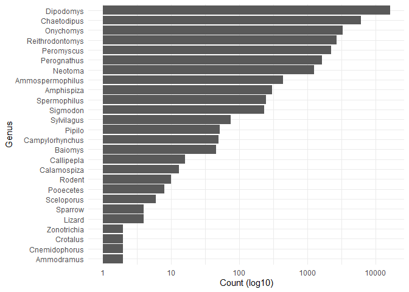
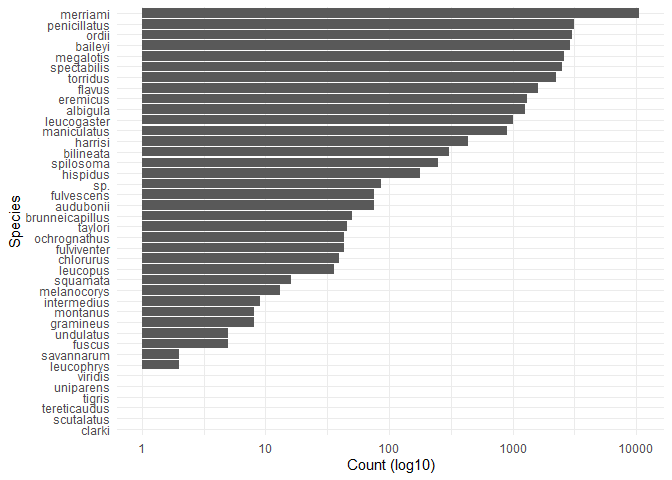
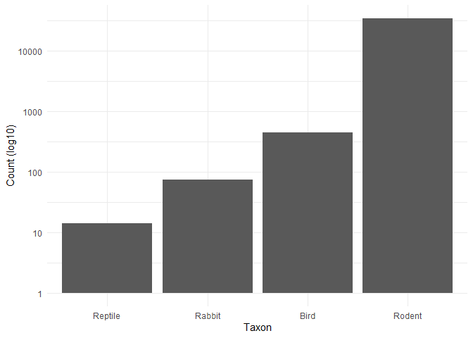
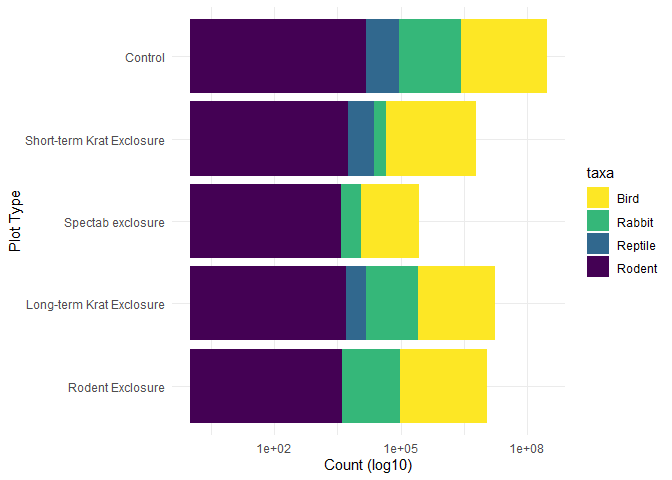
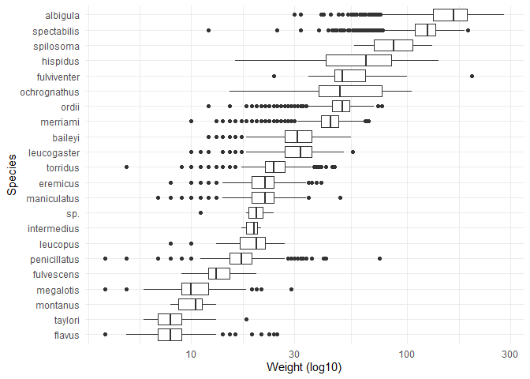
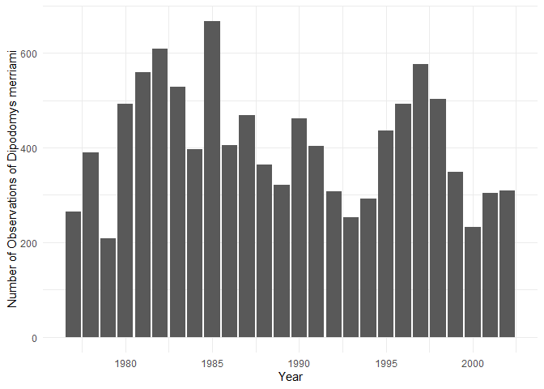
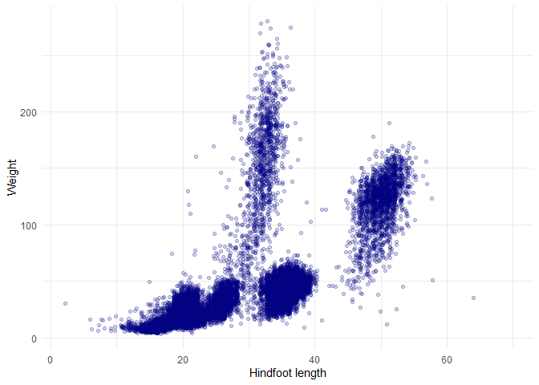
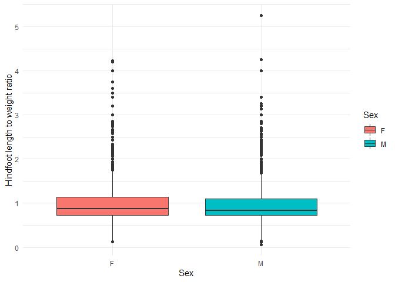
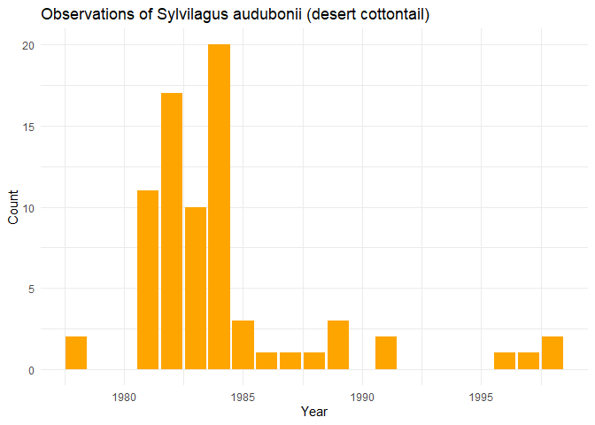

## Instructions
Answer the following questions and complete the exercises in RMarkdown. Please embed all of your code and push your final work to your repository. Your final lab report should be organized, clean, and run free from errors. Remember, you must remove the `#` for the included code chunks to run. Be sure to add your name to the author header above. For any included plots, make sure they are clearly labeled. You are free to use any plot type that you feel best communicates the results of your analysis.  

Make sure to use the formatting conventions of RMarkdown to make your report neat and clean!  

## Load the libraries

```r
library(tidyverse)
library(janitor)
library(here)
library(naniar)
library(skimr)
```

## Desert Ecology
For this assignment, we are going to use a modified data set on [desert ecology](http://esapubs.org/archive/ecol/E090/118/). The data are from: S. K. Morgan Ernest, Thomas J. Valone, and James H. Brown. 2009. Long-term monitoring and experimental manipulation of a Chihuahuan Desert ecosystem near Portal, Arizona, USA. Ecology 90:1708.

```r
deserts <- read_csv(here("lab10", "data", "surveys_complete.csv"))
```

```
## Rows: 34786 Columns: 13
```

```
## -- Column specification --------------------------------------------------------
## Delimiter: ","
## chr (6): species_id, sex, genus, species, taxa, plot_type
## dbl (7): record_id, month, day, year, plot_id, hindfoot_length, weight
```

```
## 
## i Use `spec()` to retrieve the full column specification for this data.
## i Specify the column types or set `show_col_types = FALSE` to quiet this message.
```

1. Use the function(s) of your choice to get an idea of its structure, including how NA's are treated. Are the data tidy?  
NA's in `deserts` are recorded as `NA`.

```r
deserts %>% skim()
```


Table: Data summary

|                         |           |
|:------------------------|:----------|
|Name                     |Piped data |
|Number of rows           |34786      |
|Number of columns        |13         |
|_______________________  |           |
|Column type frequency:   |           |
|character                |6          |
|numeric                  |7          |
|________________________ |           |
|Group variables          |None       |


**Variable type: character**

|skim_variable | n_missing| complete_rate| min| max| empty| n_unique| whitespace|
|:-------------|---------:|-------------:|---:|---:|-----:|--------:|----------:|
|species_id    |         0|          1.00|   2|   2|     0|       48|          0|
|sex           |      1748|          0.95|   1|   1|     0|        2|          0|
|genus         |         0|          1.00|   6|  16|     0|       26|          0|
|species       |         0|          1.00|   3|  15|     0|       40|          0|
|taxa          |         0|          1.00|   4|   7|     0|        4|          0|
|plot_type     |         0|          1.00|   7|  25|     0|        5|          0|


**Variable type: numeric**

|skim_variable   | n_missing| complete_rate|     mean|       sd|   p0|     p25|     p50|      p75|  p100|hist                                     |
|:---------------|---------:|-------------:|--------:|--------:|----:|-------:|-------:|--------:|-----:|:----------------------------------------|
|record_id       |         0|          1.00| 17804.20| 10229.68|    1| 8964.25| 17761.5| 26654.75| 35548|▇▇▇▇▇ |
|month           |         0|          1.00|     6.47|     3.40|    1|    4.00|     6.0|    10.00|    12|▇▆▆▅▇ |
|day             |         0|          1.00|    16.10|     8.25|    1|    9.00|    16.0|    23.00|    31|▆▇▇▇▆ |
|year            |         0|          1.00|  1990.50|     7.47| 1977| 1984.00|  1990.0|  1997.00|  2002|▇▆▇▇▇ |
|plot_id         |         0|          1.00|    11.34|     6.79|    1|    5.00|    11.0|    17.00|    24|▇▆▇▆▅ |
|hindfoot_length |      3348|          0.90|    29.29|     9.56|    2|   21.00|    32.0|    36.00|    70|▁▇▇▁▁ |
|weight          |      2503|          0.93|    42.67|    36.63|    4|   20.00|    37.0|    48.00|   280|▇▁▁▁▁ |
The data is tidy.

```r
deserts %>% head()
```

```
## # A tibble: 6 x 13
##   record_id month   day  year plot_id species_id sex   hindfoot_length weight
##       <dbl> <dbl> <dbl> <dbl>   <dbl> <chr>      <chr>           <dbl>  <dbl>
## 1         1     7    16  1977       2 NL         M                  32     NA
## 2         2     7    16  1977       3 NL         M                  33     NA
## 3         3     7    16  1977       2 DM         F                  37     NA
## 4         4     7    16  1977       7 DM         M                  36     NA
## 5         5     7    16  1977       3 DM         M                  35     NA
## 6         6     7    16  1977       1 PF         M                  14     NA
## # ... with 4 more variables: genus <chr>, species <chr>, taxa <chr>,
## #   plot_type <chr>
```


```r
deserts %>% tail()
```

```
## # A tibble: 6 x 13
##   record_id month   day  year plot_id species_id sex   hindfoot_length weight
##       <dbl> <dbl> <dbl> <dbl>   <dbl> <chr>      <chr>           <dbl>  <dbl>
## 1     35543    12    31  2002      15 PB         F                  27     34
## 2     35544    12    31  2002      15 US         <NA>               NA     NA
## 3     35545    12    31  2002      15 AH         <NA>               NA     NA
## 4     35546    12    31  2002      15 AH         <NA>               NA     NA
## 5     35547    12    31  2002      10 RM         F                  15     14
## 6     35548    12    31  2002       7 DO         M                  36     51
## # ... with 4 more variables: genus <chr>, species <chr>, taxa <chr>,
## #   plot_type <chr>
```


2. How many genera and species are represented in the data? What are the total number of observations? Which species is most/ least frequently sampled in the study?

The data contains 26 genera, 40 species, and 34786 observations. 

```r
# genera
genera <- deserts %>% 
  group_by(genus) %>% 
  count() %>% 
  arrange(desc(n))

genera
```

```
## # A tibble: 26 x 2
## # Groups:   genus [26]
##    genus                n
##    <chr>            <int>
##  1 Dipodomys        16167
##  2 Chaetodipus       6029
##  3 Onychomys         3267
##  4 Reithrodontomys   2694
##  5 Peromyscus        2234
##  6 Perognathus       1629
##  7 Neotoma           1252
##  8 Ammospermophilus   437
##  9 Amphispiza         303
## 10 Spermophilus       249
## # ... with 16 more rows
```


```r
ggplot(data = genera) +
  geom_col(aes(x = reorder(genus, n), y = n)) +
  scale_y_log10() +
  labs(x = "Genus",
       y = "Count (log10)") +
  coord_flip() +
  theme_minimal()
```

<!-- -->

Merriami is the most frequently sampled species and clarki, scutalatus, tereticaudus, tigris, uniparens, and viridis are the least frequently sampled species. 

```r
# species
species <- deserts %>% 
  group_by(species) %>% 
  count() %>% 
  arrange(desc(n))

species
```

```
## # A tibble: 40 x 2
## # Groups:   species [40]
##    species          n
##    <chr>        <int>
##  1 merriami     10596
##  2 penicillatus  3123
##  3 ordii         3027
##  4 baileyi       2891
##  5 megalotis     2609
##  6 spectabilis   2504
##  7 torridus      2249
##  8 flavus        1597
##  9 eremicus      1299
## 10 albigula      1252
## # ... with 30 more rows
```


```r
ggplot(data = species) +
  geom_col(aes(x = reorder(species, n), y = n)) +
  scale_y_log10() +
  coord_flip() +
  labs(x = "Species",
       y = "Count (log10)") +
  theme_minimal()
```

<!-- -->


3. What is the proportion of taxa included in this study? Show a table and plot that reflects this count.

```r
taxa <- deserts %>% 
  group_by(taxa) %>% 
  count() %>% 
  mutate(proportion = n / 34786) %>% 
  arrange(desc(n))

taxa
```

```
## # A tibble: 4 x 3
## # Groups:   taxa [4]
##   taxa        n proportion
##   <chr>   <int>      <dbl>
## 1 Rodent  34247   0.985   
## 2 Bird      450   0.0129  
## 3 Rabbit     75   0.00216 
## 4 Reptile    14   0.000402
```


```r
ggplot(data = taxa) +
  geom_col(aes(x = reorder(taxa, proportion), y = n)) + 
  scale_y_log10() +
  labs(x = "Taxon",
       y = "Count (log10)") +
  theme_minimal()
```

<!-- -->

4. For the taxa included in the study, use the fill option to show the proportion of individuals sampled by `plot_type.`

```r
plot_types <- deserts %>% 
  group_by(taxa) %>% 
  count(plot_type)

ggplot(data = plot_types) +
  geom_col(aes(x = reorder(plot_type, n), y = n, fill = taxa)) +
  scale_y_log10() +
  coord_flip() +
  labs(x = "Plot Type",
       y = "Count (log10)") +
  scale_fill_discrete(name = "Taxon") +
  scale_fill_viridis_d(direction = -1) +
  theme_minimal()
```

```
## Scale for 'fill' is already present. Adding another scale for 'fill', which
## will replace the existing scale.
```

<!-- -->

5. What is the range of weight for each species included in the study? Remove any observations of weight that are NA so they do not show up in the plot.

```r
weights <- deserts %>% 
  group_by(species) %>% 
  filter(!is.na(weight))

weights %>% 
  summarize(min = min(weight),
            median = median(weight),
            max = max(weight),
            iqr = IQR(weight)) %>% 
  arrange(desc(median))
```

```
## # A tibble: 22 x 5
##    species        min median   max   iqr
##    <chr>        <dbl>  <dbl> <dbl> <dbl>
##  1 albigula        30  164     280  58  
##  2 spectabilis     12  124     190  27  
##  3 spilosoma       57   93.5   130  36.5
##  4 hispidus        16   64.5   140  42.2
##  5 fulviventer     24   50     199  18  
##  6 ordii           12   50      76   9  
##  7 ochrognathus    15   49     105  37  
##  8 merriami        10   44      66   8  
##  9 leucogaster     10   32      56   9  
## 10 baileyi         12   31      55   9  
## # ... with 12 more rows
```


```r
ggplot(data = weights) +
  geom_boxplot(aes(x = reorder(species, weight), y = weight)) +
  scale_y_log10() +
  coord_flip() +
  labs(x = "Species", 
       y = "Weight (log10)") +
  theme_minimal()
```

<!-- -->


6. Add another layer to your answer from #4 using `geom_point` to get an idea of how many measurements were taken for each species.


```r
plot_types_species <- deserts %>% 
  group_by(species) %>% 
  count(plot_type)

plot_types_species
```

```
## # A tibble: 156 x 3
## # Groups:   species [40]
##    species   plot_type                     n
##    <chr>     <chr>                     <int>
##  1 albigula  Control                     610
##  2 albigula  Long-term Krat Exclosure    166
##  3 albigula  Rodent Exclosure            147
##  4 albigula  Short-term Krat Exclosure   252
##  5 albigula  Spectab exclosure            77
##  6 audubonii Control                      29
##  7 audubonii Long-term Krat Exclosure     17
##  8 audubonii Rodent Exclosure             24
##  9 audubonii Short-term Krat Exclosure     2
## 10 audubonii Spectab exclosure             3
## # ... with 146 more rows
```


7. [Dipodomys merriami](https://en.wikipedia.org/wiki/Merriam's_kangaroo_rat) is the most frequently sampled animal in the study. How have the number of observations of this species changed over the years included in the study?

```r
mkr <- deserts %>% 
  filter(genus == "Dipodomys", species == "merriami") %>% 
  count(year)

mkr
```

```
## # A tibble: 26 x 2
##     year     n
##    <dbl> <int>
##  1  1977   264
##  2  1978   389
##  3  1979   209
##  4  1980   493
##  5  1981   559
##  6  1982   609
##  7  1983   528
##  8  1984   396
##  9  1985   667
## 10  1986   406
## # ... with 16 more rows
```


```r
ggplot(data = mkr) +
  geom_col(aes(x = year, y = n)) +
  labs(x = "Year", 
       y = "Number of Observations of Dipodomys merriami") +
  theme_minimal()
```

<!-- -->

8. What is the relationship between `weight` and `hindfoot` length? Consider whether or not over plotting is an issue.

```r
ggplot(data = deserts) +
  geom_jitter(aes(x = hindfoot_length, y = weight), alpha = 0.2, color = "navyblue") +
  labs(x = "Hindfoot length", y = "Weight") +
  theme_minimal()
```

```
## Warning: Removed 4048 rows containing missing values (geom_point).
```

<!-- -->


9. Which two species have, on average, the highest weight? Once you have identified them, make a new column that is a ratio of `weight` to `hindfoot_length`. Make a plot that shows the range of this new ratio and fill by sex.

```r
# Highest average weight (top 2 species)
deserts %>% 
  group_by(species) %>% 
  filter(!is.na(weight)) %>% 
  summarize(average_weight = mean(weight)) %>% 
  arrange(desc(average_weight)) %>% 
  head(2)
```

```
## # A tibble: 2 x 2
##   species     average_weight
##   <chr>                <dbl>
## 1 albigula              159.
## 2 spectabilis           120.
```


```r
hindfoot_length_weight <- deserts %>% 
  group_by(species) %>% 
  filter(if_all(c(hindfoot_length, weight, sex), ~ !is.na(.x))) %>% 
  mutate(hindfoot_length_weight_ratio = hindfoot_length / weight)

ggplot(data = hindfoot_length_weight) +
  geom_boxplot(aes(x = sex, y = hindfoot_length_weight_ratio, fill = sex)) +
  labs(x = "Sex", y = "Hindfoot length to weight ratio") + 
  scale_fill_discrete(name = "Sex") +
  theme_minimal()
```

<!-- -->

10. Make one plot of your choice! Make sure to include at least two of the aesthetics options you have learned.

```r
rabbit <- deserts %>% 
  filter(genus == "Sylvilagus", species == "audubonii") %>% 
  group_by(year) %>% 
  count()

ggplot(data = rabbit) +
  geom_col(aes(x = year, y = n), fill = "orange") +
  labs(x = "Year", 
       y = "Count",
       title = "Observations of Sylvilagus audubonii (desert cottontail)") +
  theme_minimal()
```

<!-- -->

## Push your final code to GitHub!
Please be sure that you check the `keep md` file in the knit preferences. 
