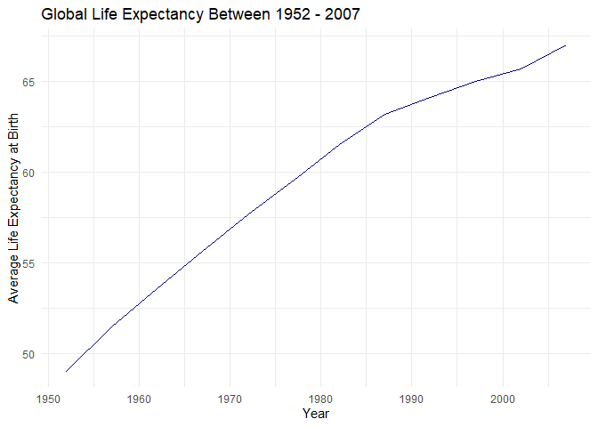
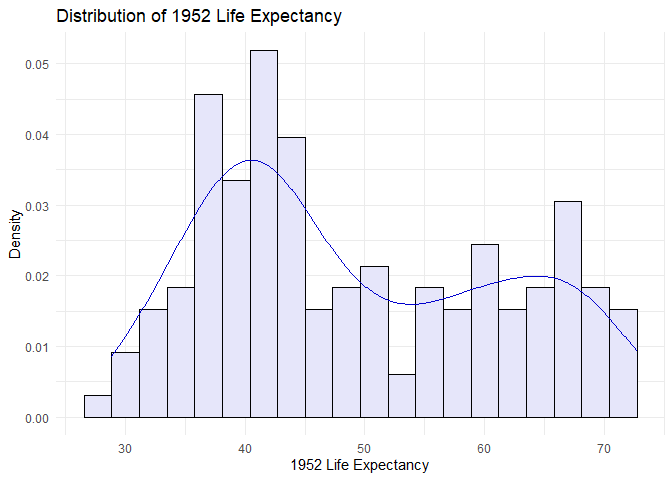
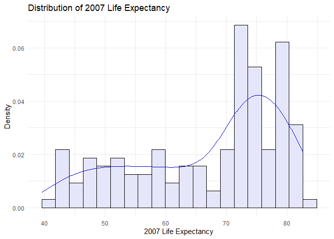
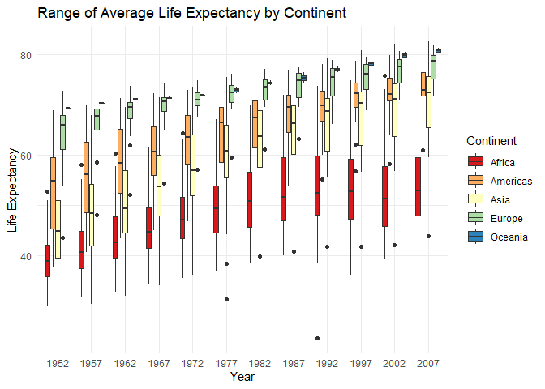
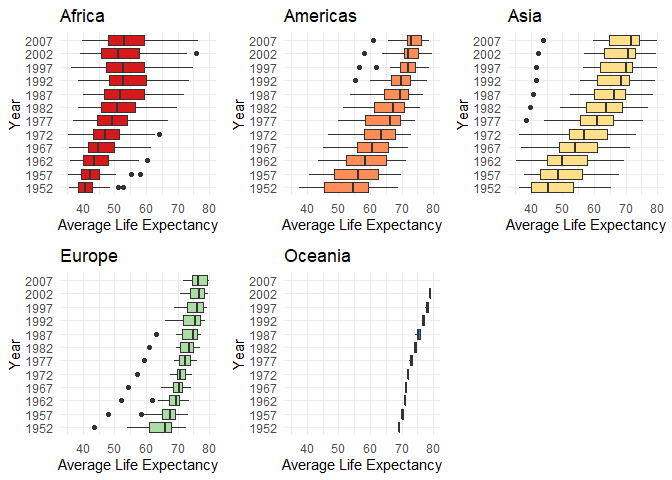
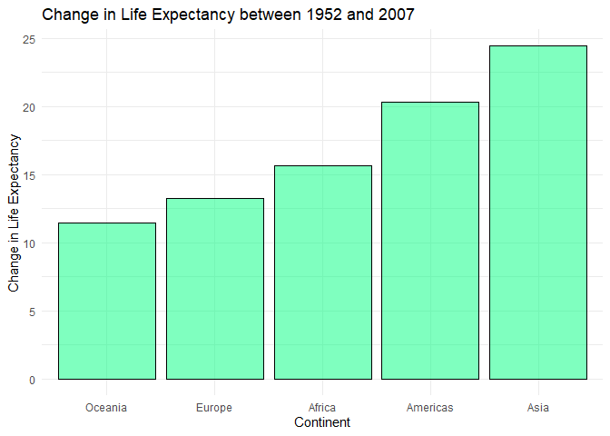
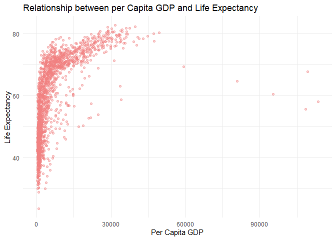
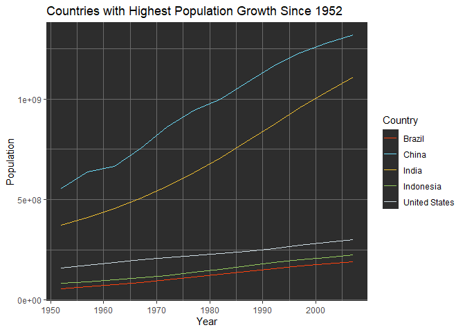
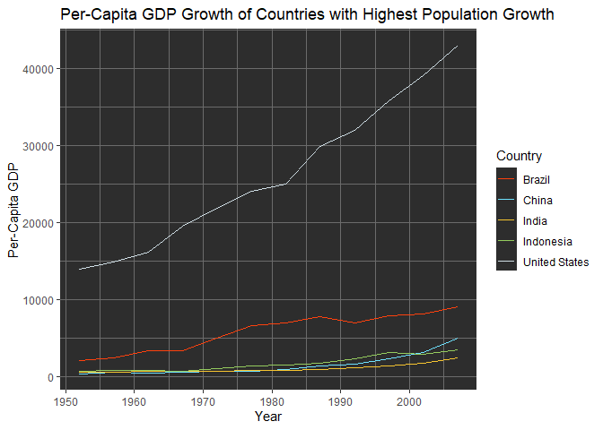
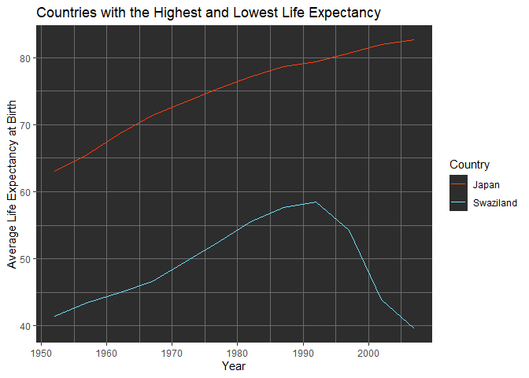

## Instructions
Answer the following questions and complete the exercises in RMarkdown. Please embed all of your code and push your final work to your repository. Your final lab report should be organized, clean, and run free from errors. Remember, you must remove the `#` for the included code chunks to run. Be sure to add your name to the author header above. For any included plots, make sure they are clearly labeled. You are free to use any plot type that you feel best communicates the results of your analysis.  

**In this homework, you should make use of the aesthetics you have learned. It's OK to be flashy!**

Make sure to use the formatting conventions of RMarkdown to make your report neat and clean!  

## Load the libraries

```r
library(tidyverse)
library(janitor)
library(here)
library(naniar)
library(skimr)
library(gridExtra)
library(ggsci)
```

## Resources
The idea for this assignment came from [Rebecca Barter's](http://www.rebeccabarter.com/blog/2017-11-17-ggplot2_tutorial/) ggplot tutorial so if you get stuck this is a good place to have a look.  

## Gapminder
For this assignment, we are going to use the dataset [gapminder](https://cran.r-project.org/web/packages/gapminder/index.html). Gapminder includes information about economics, population, and life expectancy from countries all over the world. You will need to install it before use. This is the same data that we will use for midterm 2 so this is good practice.

```r
#install.packages("gapminder")
library("gapminder")
```

## Questions
The questions below are open-ended and have many possible solutions. Your approach should, where appropriate, include numerical summaries and visuals. Be creative; assume you are building an analysis that you would ultimately present to an audience of stakeholders. Feel free to try out different `geoms` if they more clearly present your results.  

**1. Use the function(s) of your choice to get an idea of the overall structure of the data frame, including its dimensions, column names, variable classes, etc. As part of this, determine how NA's are treated in the data.**  

```r
gapminder %>% skim()
```


Table: Data summary

|                         |           |
|:------------------------|:----------|
|Name                     |Piped data |
|Number of rows           |1704       |
|Number of columns        |6          |
|_______________________  |           |
|Column type frequency:   |           |
|factor                   |2          |
|numeric                  |4          |
|________________________ |           |
|Group variables          |None       |


**Variable type: factor**

|skim_variable | n_missing| complete_rate|ordered | n_unique|top_counts                             |
|:-------------|---------:|-------------:|:-------|--------:|:--------------------------------------|
|country       |         0|             1|FALSE   |      142|Afg: 12, Alb: 12, Alg: 12, Ang: 12     |
|continent     |         0|             1|FALSE   |        5|Afr: 624, Asi: 396, Eur: 360, Ame: 300 |


**Variable type: numeric**

|skim_variable | n_missing| complete_rate|        mean|           sd|       p0|        p25|        p50|         p75|         p100|hist                                     |
|:-------------|---------:|-------------:|-----------:|------------:|--------:|----------:|----------:|-----------:|------------:|:----------------------------------------|
|year          |         0|             1|     1979.50|        17.27|  1952.00|    1965.75|    1979.50|     1993.25|       2007.0|▇▅▅▅▇ |
|lifeExp       |         0|             1|       59.47|        12.92|    23.60|      48.20|      60.71|       70.85|         82.6|▁▆▇▇▇ |
|pop           |         0|             1| 29601212.32| 106157896.74| 60011.00| 2793664.00| 7023595.50| 19585221.75| 1318683096.0|▇▁▁▁▁ |
|gdpPercap     |         0|             1|     7215.33|      9857.45|   241.17|    1202.06|    3531.85|     9325.46|     113523.1|▇▁▁▁▁ |

```r
gapminder %>% head()
```

```
## # A tibble: 6 x 6
##   country     continent  year lifeExp      pop gdpPercap
##   <fct>       <fct>     <int>   <dbl>    <int>     <dbl>
## 1 Afghanistan Asia       1952    28.8  8425333      779.
## 2 Afghanistan Asia       1957    30.3  9240934      821.
## 3 Afghanistan Asia       1962    32.0 10267083      853.
## 4 Afghanistan Asia       1967    34.0 11537966      836.
## 5 Afghanistan Asia       1972    36.1 13079460      740.
## 6 Afghanistan Asia       1977    38.4 14880372      786.
```

```r
gapminder %>% tail()
```

```
## # A tibble: 6 x 6
##   country  continent  year lifeExp      pop gdpPercap
##   <fct>    <fct>     <int>   <dbl>    <int>     <dbl>
## 1 Zimbabwe Africa     1982    60.4  7636524      789.
## 2 Zimbabwe Africa     1987    62.4  9216418      706.
## 3 Zimbabwe Africa     1992    60.4 10704340      693.
## 4 Zimbabwe Africa     1997    46.8 11404948      792.
## 5 Zimbabwe Africa     2002    40.0 11926563      672.
## 6 Zimbabwe Africa     2007    43.5 12311143      470.
```

```r
gapminder %>% any_na()
```

```
## [1] FALSE
```


**2. Among the interesting variables in gapminder is life expectancy. How has global life expectancy changed between 1952 and 2007?**

Global life expectancy has increased by approximately 18 years between 1952 and 2007.

```r
global_life_exp <- gapminder %>% 
  group_by(year) %>% 
  summarize(mean_life_expectancy = mean(lifeExp))

global_life_exp
```

```
## # A tibble: 12 x 2
##     year mean_life_expectancy
##    <int>                <dbl>
##  1  1952                 49.1
##  2  1957                 51.5
##  3  1962                 53.6
##  4  1967                 55.7
##  5  1972                 57.6
##  6  1977                 59.6
##  7  1982                 61.5
##  8  1987                 63.2
##  9  1992                 64.2
## 10  1997                 65.0
## 11  2002                 65.7
## 12  2007                 67.0
```

```r
ggplot(data = global_life_exp) +
  geom_line(aes(x = year, y = mean_life_expectancy), color = "darkblue") +
  labs(x = "Year",
       y = "Average Life Expectancy at Birth",
       title = "Global Life Expectancy Between 1952 - 2007") +
  theme_minimal()
```

<!-- -->


**3. How do the distributions of life expectancy compare for the years 1952 and 2007?**

Life expectancy in 1952 was centered around 45 years and skewed right.

```r
life_exp_1952 <- gapminder %>% 
  filter(year == "1952")

ggplot(data = life_exp_1952) +
  geom_histogram(aes(x = lifeExp, y = ..density..), fill = "lavender", color = "black", bins = 20) +
  geom_density(aes(x = lifeExp, y = ..density..), color = "mediumblue") +
  labs(x = "1952 Life Expectancy",
       y = "Density",
       title = "Distribution of 1952 Life Expectancy") +
  theme_minimal()
```

<!-- -->

Life expectancy in 2007 was centered around 72 years and skewed left.

```r
life_exp_2007 <- gapminder %>% 
  filter(year == "2007")

ggplot(data = life_exp_2007) +
  geom_histogram(aes(x = lifeExp, y = ..density..), fill = "lavender", color = "black", bins = 20) +
  geom_density(aes(x = lifeExp, y = ..density..), color = "mediumblue") +
  labs(x = "2007 Life Expectancy",
       y = "Density",
       title = "Distribution of 2007 Life Expectancy") +
  theme_minimal()
```

<!-- -->


**4. Your answer above doesn't tell the whole story since life expectancy varies by region. Make a summary that shows the min, mean, and max life expectancy by continent for all years represented in the data.**

```r
continent_life_exp <- gapminder %>% 
  group_by(continent, year) %>% 
  summarize(min = min(lifeExp),
            mean = mean(lifeExp),
            max = max(lifeExp),
            .groups = "keep")

continent_life_exp %>% 
  arrange(year)
```

```
## # A tibble: 60 x 5
## # Groups:   continent, year [60]
##    continent  year   min  mean   max
##    <fct>     <int> <dbl> <dbl> <dbl>
##  1 Africa     1952  30    39.1  52.7
##  2 Americas   1952  37.6  53.3  68.8
##  3 Asia       1952  28.8  46.3  65.4
##  4 Europe     1952  43.6  64.4  72.7
##  5 Oceania    1952  69.1  69.3  69.4
##  6 Africa     1957  31.6  41.3  58.1
##  7 Americas   1957  40.7  56.0  70.0
##  8 Asia       1957  30.3  49.3  67.8
##  9 Europe     1957  48.1  66.7  73.5
## 10 Oceania    1957  70.3  70.3  70.3
## # ... with 50 more rows
```

```r
# All continents
 gapminder %>% 
  mutate(year = factor(year)) %>% 
  ggplot() +
    geom_boxplot(aes(x = year, y = lifeExp, fill = continent)) +
    labs(x = "Year",
         y = "Life Expectancy",
         title = "Range of Average Life Expectancy by Continent",
         fill = "Continent") +
    scale_fill_brewer(palette = "Spectral") +
    theme_minimal()
```

<!-- -->


```r
# Separate figures for each continent

# Africa
africa <- gapminder %>% 
  mutate(year = factor(year)) %>% 
  filter(continent == "Africa") %>% 
  ggplot() +
    geom_boxplot(aes(x = year, y = lifeExp), fill = "#d7191c") +
    labs(x = "Year",
         y = "Average Life Expectancy",
         title = "Africa") +
    coord_flip() +
    ylim(35, 80) +
    theme_minimal()

# Americas
americas <- gapminder %>% 
  mutate(year = factor(year)) %>% 
  filter(continent == "Americas") %>% 
  ggplot() +
    geom_boxplot(aes(x = year, y = lifeExp), fill = "#fc8d59") +
    labs(x = "Year",
         y = "Average Life Expectancy",
         title = "Americas") +
    coord_flip() +
    ylim(35, 80) +
    theme_minimal()

# Asia
asia <- gapminder %>% 
  mutate(year = factor(year)) %>% 
  filter(continent == "Asia") %>% 
  ggplot() +
    geom_boxplot(aes(x = year, y = lifeExp), fill = "#fee08b") +
    labs(x = "Year",
         y = "Average Life Expectancy",
         title = "Asia") +
    coord_flip() +
    ylim(35, 80) +
    theme_minimal()

# Europe
europe <- gapminder %>% 
  mutate(year = factor(year)) %>% 
  filter(continent == "Europe") %>% 
  ggplot() +
    geom_boxplot(aes(x = year, y = lifeExp), fill = "#abdda4") +
    labs(x = "Year",
         y = "Average Life Expectancy",
         title = "Europe") +
    coord_flip() +
    ylim(35, 80) +
    theme_minimal()

# Oceania
oceania <- gapminder %>% 
  mutate(year = factor(year)) %>% 
  filter(continent == "Oceania") %>% 
  ggplot() +
    geom_boxplot(aes(x = year, y = lifeExp), fill = "#2b83ba") +
    labs(x = "Year",
         y = "Average Life Expectancy",
         title = "Oceania") +
    coord_flip() +
    ylim(35, 80) +
    theme_minimal()

grid.arrange(africa, americas, asia, europe, oceania, nrow = 2)
```

<!-- -->


**5. How has life expectancy changed between 1952-2007 for each continent?**

Between 1952 - 2007, life expectancy has increased by at least 11 years for each continent.

```r
continent_change <- continent_life_exp %>% 
  select(continent, year, mean) %>% 
  pivot_wider(names_from = year, values_from = -c(continent, year)) %>% 
  select(continent, `1952`, `2007`) %>% 
  mutate(change = `2007` - `1952`)

continent_change
```

```
## # A tibble: 5 x 4
## # Groups:   continent [5]
##   continent `1952` `2007` change
##   <fct>      <dbl>  <dbl>  <dbl>
## 1 Africa      39.1   54.8   15.7
## 2 Americas    53.3   73.6   20.3
## 3 Asia        46.3   70.7   24.4
## 4 Europe      64.4   77.6   13.2
## 5 Oceania     69.3   80.7   11.5
```


```r
ggplot(data = continent_change) +
  geom_col(aes(x = reorder(continent, change), y = change), fill = "springgreen", color = "black", alpha = 0.5) +
  labs(x = "Continent",
       y = "Change in Life Expectancy",
       title = "Change in Life Expectancy between 1952 and 2007") +
  theme_minimal()
```

<!-- -->


**6. We are interested in the relationship between per capita GDP and life expectancy; i.e. does having more money help you live longer?**

Having more money increases life expectancy up to a per capita GDP of around 30,000.

```r
ggplot(data = gapminder) + 
  geom_jitter(aes(x = gdpPercap, y = lifeExp), alpha = 0.4, color = "lightcoral") +
  labs(x = "Per Capita GDP",
       y = "Life Expectancy",
       title = "Relationship between per Capita GDP and Life Expectancy") +
  theme_minimal()
```

<!-- -->


**7. Which countries have had the largest population growth since 1952?**

```r
pop_growth <- gapminder %>% 
  group_by(country) %>% 
  slice(which(c(year == "1952" | year == "2007"))) %>% 
  select(country, year, pop) %>% 
  pivot_wider(names_from = "year", values_from = "pop") %>% 
  mutate(pop_growth = `2007` - `1952`) %>% 
  arrange(desc(pop_growth))

pop_growth <- pop_growth %>% 
  select(country, pop_growth)

pop_growth
```

```
## # A tibble: 142 x 2
## # Groups:   country [142]
##    country       pop_growth
##    <fct>              <int>
##  1 China          762419569
##  2 India          738396331
##  3 United States  143586947
##  4 Indonesia      141495000
##  5 Brazil         133408087
##  6 Pakistan       127924057
##  7 Bangladesh     103561480
##  8 Nigeria        101912068
##  9 Mexico          78556574
## 10 Philippines     68638596
## # ... with 132 more rows
```
**8. Use your results from the question above to plot population growth for the top five countries since 1952.**

```r
top_five <- pop_growth$country %>% 
  head(5) %>% 
  as.vector()

gapminder %>% 
  filter(country %in% top_five) %>% 
  select(country, year, pop) %>% 
  ggplot() +
    geom_line(aes(x = year, y = pop, color = country)) +
    labs(x = "Year",
         y = "Population",
         title = "Countries with Highest Population Growth Since 1952",
         color = "Country") +
    scale_color_tron() +
    theme_dark() +
    theme(panel.background = element_rect(fill = "#2D2D2D"),
          legend.key = element_rect(fill = "#2D2D2D"))
```

<!-- -->

**9. How does per-capita GDP growth compare between these same five countries?**


```r
gapminder %>% 
  filter(country %in% top_five) %>% 
  select(country, year, gdpPercap) %>% 
  ggplot() +
  geom_line(aes(x = year, y = gdpPercap, color = country)) +
    labs(x = "Year",
         y = "Per-Capita GDP",
         title = "Per-Capita GDP Growth of Countries with Highest Population Growth",
         color = "Country") +
    theme(plot.title = element_text(size = 12)) +
    scale_color_tron() +
    theme_dark() +
    theme(panel.background = element_rect(fill = "#2D2D2D"),
          legend.key = element_rect(fill = "#2D2D2D"))
```

<!-- -->


**10. Make one plot of your choice that uses faceting!**

I am interested in the how life expectancy has changed over time in the countries with the highest and lowest life expectancies in 2007. 

Japan had the highest life expectancy in 2007, and the life expectancy had been steadily increasing since 1952. Swaziland has the lowest life expectancy in 2007, but the life expectancy had been increasing since 1952 until around 1990. The drop in life expectancy in Swaziland after 1990 reflects the increase in the [prevalence of HIV/AIDs](https://reliefweb.int/report/swaziland/swaziland-life-expectancy-drop-40-yrs-2010-report) in the country since the first reported case in 1987. 

```r
top_life_exp <- gapminder %>% 
  group_by(country) %>% 
  pivot_wider(names_from = "year", values_from = "lifeExp") %>% 
  select(country, `2007`) %>% 
  arrange(desc(`2007`)) %>% 
  head(1)

top_life_exp <- top_life_exp$country %>% 
  as.vector()

bottom_life_exp <- gapminder %>% 
  group_by(country) %>% 
  pivot_wider(names_from = "year", values_from = "lifeExp") %>% 
  select(country, `2007`) %>% 
  arrange(`2007`) %>% 
  head(1)
  
bottom_life_exp <- bottom_life_exp$country %>% 
  as.vector()

gapminder %>% 
  filter(country %in% top_life_exp | country %in% bottom_life_exp) %>% 
  ggplot() +
    geom_line(aes(x = year , y = lifeExp, color = country)) +
    labs(x = "Year",
         y = "Average Life Expectancy at Birth",
         title = "Countries with the Highest and Lowest Life Expectancy",
         color = "Country") +
    scale_color_tron() +
    theme_dark() +
    theme(panel.background = element_rect(fill = "#2D2D2D"),
        legend.key = element_rect(fill = "#2D2D2D"))
```

<!-- -->

## Push your final code to GitHub!
Please be sure that you check the `keep md` file in the knit preferences. 
