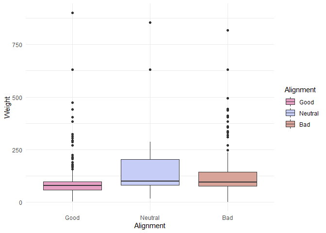
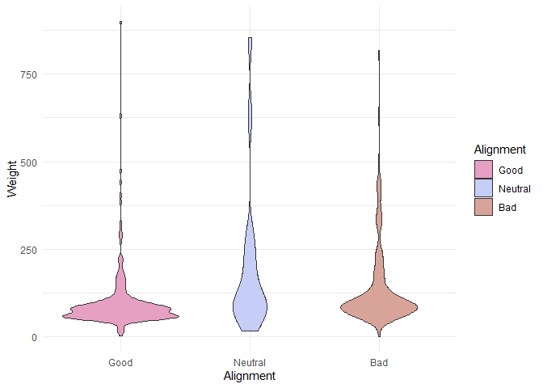
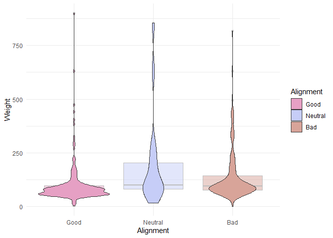
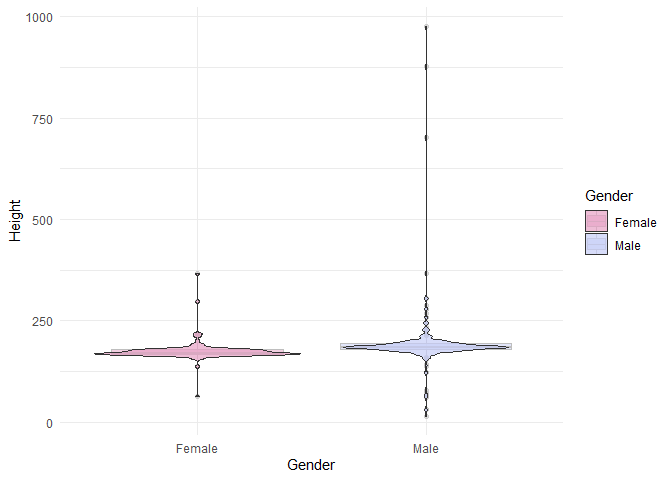
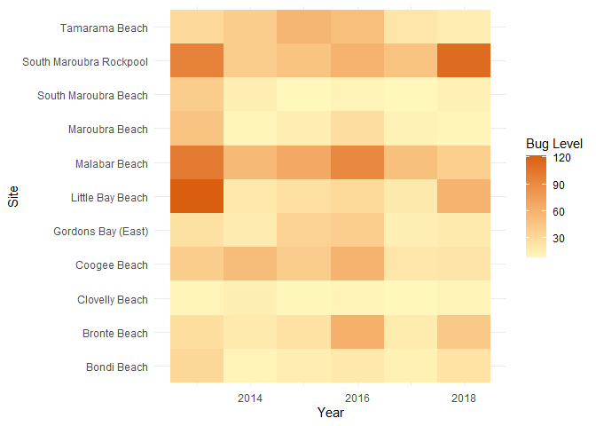
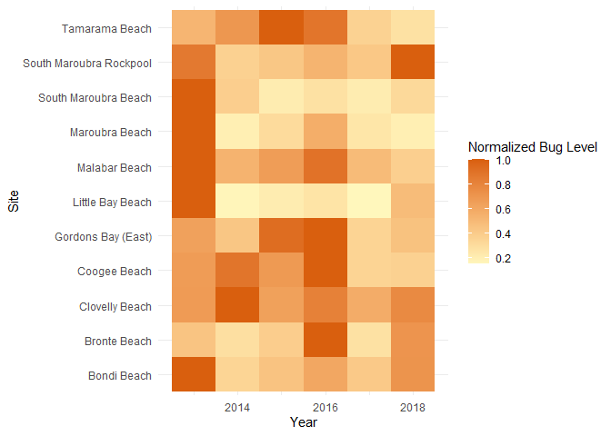
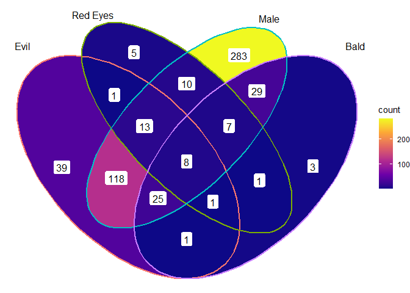
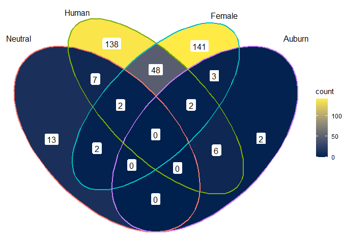
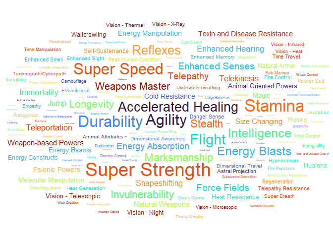
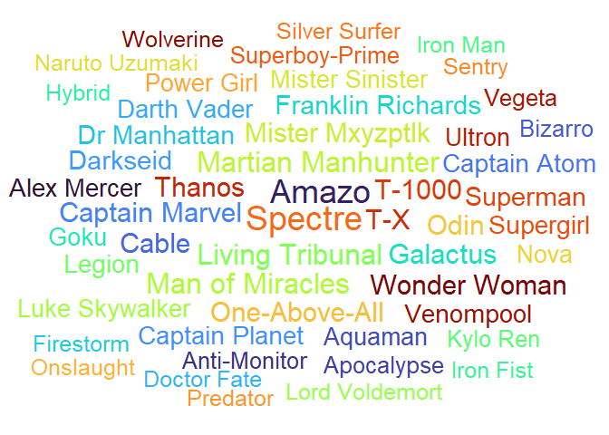

### Load the Libraries

```r
library(tidyverse)
library(janitor)
library(palmerpenguins)
library(skimr)
library(naniar)
library(wesanderson)
library(ggsci)

#install.packages("ggVennDiagram")
library(ggVennDiagram)
library(RColorBrewer)

#install.packages("ggworldcloud")
library(ggwordcloud)

options(scipen=999) #cancels the use of scientific notation for the session
```


### Data

```r
superhero_info <- readr::read_csv("../lab14/data/heroes_information.csv", na = c("", "-99", "-"))
superhero_powers <- readr::read_csv("../lab14/data/super_hero_powers.csv", na = c("", "-99", "-"))

beachbugs_long <- readr::read_csv("../lab14/data/beachbugs_long.csv")
```

### 1. 
Clean up the column names (no capitals, not spaces) of `superhero_info`, then use 2 functions to remind yourself of structure of the `superhero_info` data set.


```r
superhero_info <- superhero_info %>% 
  clean_names()
```


```r
superhero_info %>% 
  skim()
```


Table: Data summary

|                         |           |
|:------------------------|:----------|
|Name                     |Piped data |
|Number of rows           |734        |
|Number of columns        |10         |
|_______________________  |           |
|Column type frequency:   |           |
|character                |8          |
|numeric                  |2          |
|________________________ |           |
|Group variables          |None       |


**Variable type: character**

|skim_variable | n_missing| complete_rate| min| max| empty| n_unique| whitespace|
|:-------------|---------:|-------------:|---:|---:|-----:|--------:|----------:|
|name          |         0|          1.00|   1|  25|     0|      715|          0|
|gender        |        29|          0.96|   4|   6|     0|        2|          0|
|eye_color     |       172|          0.77|   3|  23|     0|       22|          0|
|race          |       304|          0.59|   5|  18|     0|       61|          0|
|hair_color    |       172|          0.77|   3|  16|     0|       29|          0|
|publisher     |        15|          0.98|   4|  17|     0|       24|          0|
|skin_color    |       662|          0.10|   3|  14|     0|       16|          0|
|alignment     |         7|          0.99|   3|   7|     0|        3|          0|


**Variable type: numeric**

|skim_variable | n_missing| complete_rate|   mean|     sd|   p0| p25| p50| p75| p100|hist                                     |
|:-------------|---------:|-------------:|------:|------:|----:|---:|---:|---:|----:|:----------------------------------------|
|height        |       217|          0.70| 186.73|  59.25| 15.2| 173| 183| 191|  975|▇▁▁▁▁ |
|weight        |       239|          0.67| 112.25| 104.15|  2.0|  61|  81| 108|  900|▇▁▁▁▁ |

```r
superhero_info %>% 
  miss_var_summary()
```

```
## # A tibble: 10 x 3
##    variable   n_miss pct_miss
##    <chr>       <int>    <dbl>
##  1 skin_color    662   90.2  
##  2 race          304   41.4  
##  3 weight        239   32.6  
##  4 height        217   29.6  
##  5 eye_color     172   23.4  
##  6 hair_color    172   23.4  
##  7 gender         29    3.95 
##  8 publisher      15    2.04 
##  9 alignment       7    0.954
## 10 name            0    0
```


### 2.
Are bad guys bigger? Make box-plots of weight by `alignment` (alignment on the x-axis).

```r
ggplot(data = superhero_info %>% 
         filter(if_all(c(weight, alignment), ~ !is.na(.))) %>% 
         mutate(alignment = factor(alignment, levels = c("good", "neutral", "bad")),
                alignment = recode(alignment,
                                   good = "Good",
                                   neutral = "Neutral",
                                   bad = "Bad"))) +
  geom_boxplot(aes(x = alignment, y = weight, fill = alignment)) +
  labs(x = "Alignment",
       y = "Weight",
       fill = "Alignment") +
  scale_fill_manual(values = wes_palette("GrandBudapest2")) +
  theme_minimal()
```

<!-- -->

### 3. 
Now, make a violin plot of weight by `alignment` (alignment on the x-axis). Add some color!
  What information can you observe in the violin plot that was not visible in the boxplot?
  
The violin plots show the distribution of weight across alignments.

```r
ggplot(data = superhero_info %>% 
         filter(if_all(c(weight, alignment), ~ !is.na(.))) %>% 
         mutate(alignment = factor(alignment, levels = c("good", "neutral", "bad")),
                alignment = recode(alignment,
                                   good = "Good",
                                   neutral = "Neutral",
                                   bad = "Bad"))) +
  geom_violin(aes(x = alignment, y = weight, fill = alignment)) +
  labs(x = "Alignment",
       y = "Weight",
       fill = "Alignment") +
  scale_fill_manual(values = wes_palette("GrandBudapest2")) +
  theme_minimal()
```

<!-- -->


### 4. 
Use `alpha = .5` in `geom_boxplot()` and `geom_violin()` to layer both plots on top of one another. What does this tell you about the distribution of weight in "`bad`" guys?

The violin plot suggests that weight in "bad" guys is skewed right. 

```r
ggplot(data = superhero_info %>% 
         filter(if_all(c(weight, alignment), ~ !is.na(.))) %>% 
         mutate(alignment = factor(alignment, levels = c("good", "neutral", "bad")),
                alignment = recode(alignment,
                                   good = "Good",
                                   neutral = "Neutral",
                                   bad = "Bad"))) +
  geom_boxplot(aes(x = alignment, y = weight, fill = alignment), alpha = 0.5, color = "gray") +
  geom_violin(aes(x = alignment, y = weight, fill = alignment)) +
  labs(x = "Alignment",
       y = "Weight",
       fill = "Alignment") +
  scale_fill_manual(values = wes_palette("GrandBudapest2")) +
  theme_minimal()
```

<!-- -->

### 5. 
Box plots are great for showing how the distribution of a numeric variable (e.g. weight) varies among a categorical variable (e.g. alignment).
  Make your own violin plot with the superhero data. 
  What is your numeric data? 
  What is your categorical variable?

I will create a violin plot of height among gender. Height is numeric and gender is categorical.

```r
ggplot(data = superhero_info %>% 
         filter(if_all(c(gender, height), ~ !is.na(.)))) +
  geom_boxplot(aes(x = gender, y = height, fill = gender), alpha = 0.5, color = "gray") +
  geom_violin(aes(x = gender, y = height, fill = gender), alpha = 0.7) +
  labs(x = "Gender",
       y = "Height",
       fill = "Gender") +
  scale_fill_manual(values = wes_palette("GrandBudapest2")) +
  theme_minimal()
```

<!-- -->

### 6. 
Remind yourself what `beachbugs` looks like. Then generate a heatmap of buglevels by site and year. 
color it with `scale_fill_gradient(low="yellow", high="red")` or colors of your choice. you may find it looks best with one color!
(dont forget, `coord_flip()` is a quick way to improve the look of your plot if you dont like the default orientation)


```r
beachbugs_long %>% 
  skim()
```


Table: Data summary

|                         |           |
|:------------------------|:----------|
|Name                     |Piped data |
|Number of rows           |66         |
|Number of columns        |3          |
|_______________________  |           |
|Column type frequency:   |           |
|character                |1          |
|numeric                  |2          |
|________________________ |           |
|Group variables          |None       |


**Variable type: character**

|skim_variable | n_missing| complete_rate| min| max| empty| n_unique| whitespace|
|:-------------|---------:|-------------:|---:|---:|-----:|--------:|----------:|
|site          |         0|             1|  11|  23|     0|       11|          0|


**Variable type: numeric**

|skim_variable | n_missing| complete_rate|   mean|    sd|      p0|     p25|     p50|     p75|    p100|hist                                     |
|:-------------|---------:|-------------:|------:|-----:|-------:|-------:|-------:|-------:|-------:|:----------------------------------------|
|year          |         0|             1| 2015.5|  1.72| 2013.00| 2014.00| 2015.50| 2017.00| 2018.00|▇▃▃▃▃ |
|buglevels     |         0|             1|   34.1| 26.31|    7.93|   14.38|   25.13|   47.08|  121.53|▇▃▂▁▁ |


```r
ggplot(data = beachbugs_long) +
  geom_tile(aes(x = site, y = year, fill = buglevels)) +
  labs(x = "Site",
       y = "Year",
       fill = "Bug Level") +
  scale_fill_gradient(low="#fff7bc", high="#d95f0e") +
  coord_flip() +
  theme_minimal()
```

<!-- -->

### 7.  
Use the provided code to normalize the beachbug data set. 
Then make a heatmap with the `beachbugs_normalized` data, and use the same color chois as above. Which heatmap do you think is more informative? why?

I think that the `beachbugs_normalized` data is more informative because it allows us to make easier comparisons across sites.

```r
#makes a new column of the highest buglevel observed at each site
beachbugs_w_max <- beachbugs_long %>% 
  group_by(site) %>% 
  mutate(max_buglevel = max(buglevels, na.rm=T)) %>% 
  arrange(site)

#makes a new table where the buglevels are normalized to the max_buglevel
beachbugs_normalized <- beachbugs_w_max %>% 
  group_by(site) %>% 
  mutate(norm_buglevel = buglevels/max_buglevel) %>% 
  arrange(site,year) %>%
  select(site, year, norm_buglevel)   # you dont have to select(), but I think its a clearer looking table
```
 

```r
ggplot(data = beachbugs_normalized) +
  geom_tile(aes(x = site, y = year, fill = norm_buglevel)) +
  labs(x = "Site",
       y = "Year",
       fill = "Normalized Bug Level") +
  scale_fill_gradient(low="#fff7bc", high="#d95f0e") +
  coord_flip() +
  theme_minimal()
```

<!-- -->

### 8.
Let's make a venn diagram of `superhero_info`, from 4 questions:
Is their alignment evil? 
Are their eyes red?
Are they male?
Are they bald?

Start by making the 4 vectors, then the list of vectors. The vector for alignment is provided:
### super heros venn

Your list of vectors will look something like this:

```r
# questions_list <- list(evil_vec, red_eye_vec, male_vec, bald_vec)
```


```r
variables <- superhero_info %>% 
  select(alignment, eye_color, gender, hair_color)

conditions <- c("bad", "red", "Male", "No Hair")

venn_vec_names <- c("evil", "red_eyes", "male", "bald")

venn_pull <- function(variable, condition) {
  superhero_info %>% 
    filter(variable == condition) %>%
    pull(name) 
}

for (i in 1:4) {
  assign(paste(venn_vec_names[i], "_vec", sep = ""),
         venn_pull(variables[i], conditions[i]))
}

venn_list <- list(evil_vec, red_eyes_vec, male_vec, bald_vec)
```


### 9. 
Let's make the venn diagram! use the code from lab as a reference. 

```r
ggVennDiagram(venn_list, 
              category.names = c("Evil", "Red Eyes", "Male", "Bald"),
              label = "count",
              label_geom = "label",
              label_alpha = 1) +
  scale_fill_viridis_c(option = "plasma")
```

<!-- -->


### 10. Choose one intersection of the venn diagram that is interesting to you. Use dplyr to find the names of the superheros in that intersection. 

I am interested in the intersection between evil and red eyes which excludes male superheros.


```r
superhero_info %>% 
  filter(eye_color == "red",
         alignment == "bad",
         gender != "Male")
```

```
## # A tibble: 1 x 10
##   name   gender eye_color race  hair_color height publisher skin_color alignment
##   <chr>  <chr>  <chr>     <chr> <chr>       <dbl> <chr>     <chr>      <chr>    
## 1 Spide~ Female red       <NA>  White         178 Marvel C~ <NA>       bad      
## # ... with 1 more variable: weight <dbl>
```


### 11. Make another venn diagram with the `superhero_info` data. What are your questions? ( At least 2!) 

Is their alignment neutral?
Is their race human?
Are they female?
Is their hair auburn?

```r
variables <- superhero_info %>% 
  select(alignment, race, gender, hair_color)

conditions <- c("neutral", "Human", "Female", "Auburn")

venn_vec_names <- c("neutral", "human", "female", "auburn")

for (i in 1:4) {
  assign(paste(venn_vec_names[i], "_vec", sep = ""),
         venn_pull(variables[i], conditions[i]))
}

venn_list <- list(neutral_vec, human_vec, female_vec, auburn_vec)
```


```r
ggVennDiagram(venn_list, 
              category.names = c("Neutral", "Human", "Female", "Auburn"),
              label = "count",
              label_geom = "label",
              label_alpha = 1) +
  scale_fill_viridis_c(option = "cividis")
```

<!-- -->

```r
superhero_info %>%
  filter(race == "Human",
         gender == "Female",
         alignment == "neutral")
```

```
## # A tibble: 2 x 10
##   name   gender eye_color race  hair_color height publisher skin_color alignment
##   <chr>  <chr>  <chr>     <chr> <chr>       <dbl> <chr>     <chr>      <chr>    
## 1 Raven  Female indigo    Human Black         165 DC Comics <NA>       neutral  
## 2 Robin~ Female green     Human Red            NA DC Comics <NA>       neutral  
## # ... with 1 more variable: weight <dbl>
```


### 12.
What are some very common super powers? Lets make a word cloud with the `superhero_powers` data.

Use the provided code to make the frequency table, then make a word cloud with it. 
Remember, you can change `scale_size_area(max_size = 20)` to a different number if the words wont fit!


```r
head(superhero_powers)
```

```
## # A tibble: 6 x 168
##   hero_names  Agility `Accelerated Healing` `Lantern Power Ri~` `Dimensional A~`
##   <chr>       <lgl>   <lgl>                 <lgl>               <lgl>           
## 1 3-D Man     TRUE    FALSE                 FALSE               FALSE           
## 2 A-Bomb      FALSE   TRUE                  FALSE               FALSE           
## 3 Abe Sapien  TRUE    TRUE                  FALSE               FALSE           
## 4 Abin Sur    FALSE   FALSE                 TRUE                FALSE           
## 5 Abomination FALSE   TRUE                  FALSE               FALSE           
## 6 Abraxas     FALSE   FALSE                 FALSE               TRUE            
## # ... with 163 more variables: `Cold Resistance` <lgl>, Durability <lgl>,
## #   Stealth <lgl>, `Energy Absorption` <lgl>, Flight <lgl>,
## #   `Danger Sense` <lgl>, `Underwater breathing` <lgl>, Marksmanship <lgl>,
## #   `Weapons Master` <lgl>, `Power Augmentation` <lgl>,
## #   `Animal Attributes` <lgl>, Longevity <lgl>, Intelligence <lgl>,
## #   `Super Strength` <lgl>, Cryokinesis <lgl>, Telepathy <lgl>,
## #   `Energy Armor` <lgl>, `Energy Blasts` <lgl>, Duplication <lgl>, ...
```


```r
power_frequency <- superhero_powers %>% 
  select(-hero_names) %>%
  summarise_all(~(sum(.))) %>%
  pivot_longer(everything(), names_to = "power", values_to = "freq")
power_frequency
```

```
## # A tibble: 167 x 2
##    power                  freq
##    <chr>                 <int>
##  1 Agility                 242
##  2 Accelerated Healing     178
##  3 Lantern Power Ring       11
##  4 Dimensional Awareness    25
##  5 Cold Resistance          47
##  6 Durability              257
##  7 Stealth                 126
##  8 Energy Absorption        77
##  9 Flight                  212
## 10 Danger Sense             30
## # ... with 157 more rows
```


```r
ggplot(data = power_frequency) +
  geom_text_wordcloud(aes(label = power, size = freq, color = power)) +
  scale_size_area(max_size = 10) +
  scale_color_viridis_d(option = "turbo") +
  theme_minimal()
```

<!-- -->


### 13.  
Who are some very powerful supers? 
 Lets make a different word cloud with the `superhero_powers` data. 
Use the provided code to make the frequency table, then make a word cloud with it.
You can use `hero_names` for the labels, and `sum_powers` for size. 


```r
power_quantity <- superhero_powers %>% 
  pivot_longer(-hero_names, names_to = "power", values_to = "yes_or_no") %>% 
  group_by(hero_names) %>% 
  mutate(sum_powers = sum(yes_or_no, na.rm=T)) %>%
  arrange(desc(sum_powers), hero_names, desc(yes_or_no))
power_quantity
```

```
## # A tibble: 111,389 x 4
## # Groups:   hero_names [667]
##    hero_names power                 yes_or_no sum_powers
##    <chr>      <chr>                 <lgl>          <int>
##  1 Spectre    Agility               TRUE              49
##  2 Spectre    Accelerated Healing   TRUE              49
##  3 Spectre    Dimensional Awareness TRUE              49
##  4 Spectre    Stealth               TRUE              49
##  5 Spectre    Energy Absorption     TRUE              49
##  6 Spectre    Flight                TRUE              49
##  7 Spectre    Marksmanship          TRUE              49
##  8 Spectre    Longevity             TRUE              49
##  9 Spectre    Intelligence          TRUE              49
## 10 Spectre    Super Strength        TRUE              49
## # ... with 111,379 more rows
```

```r
#we have to trim down to only the top 50, or it will crowd the image!
power_quantity <- power_quantity %>% 
  ungroup %>%
  distinct(hero_names, sum_powers) %>%
  slice_max(sum_powers, n = 50)
power_quantity
```

```
## # A tibble: 51 x 2
##    hero_names        sum_powers
##    <chr>                  <int>
##  1 Spectre                   49
##  2 Amazo                     44
##  3 Living Tribunal           35
##  4 Martian Manhunter         35
##  5 Man of Miracles           34
##  6 Captain Marvel            33
##  7 T-X                       33
##  8 Galactus                  32
##  9 T-1000                    32
## 10 Mister Mxyzptlk           31
## # ... with 41 more rows
```


```r
ggplot(data = power_quantity) +
  geom_text_wordcloud(aes(label = hero_names, size = sum_powers, color = hero_names)) +
  scale_size_area(max_size = 10) +
  scale_color_viridis_d(option = "turbo") +
  theme_minimal()
```

<!-- -->

## That's it! 🎉
Thanks for coding with us all winter! 
Now go finish your group project :) 

