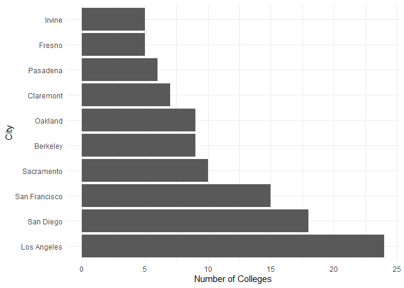
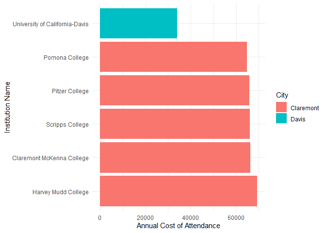
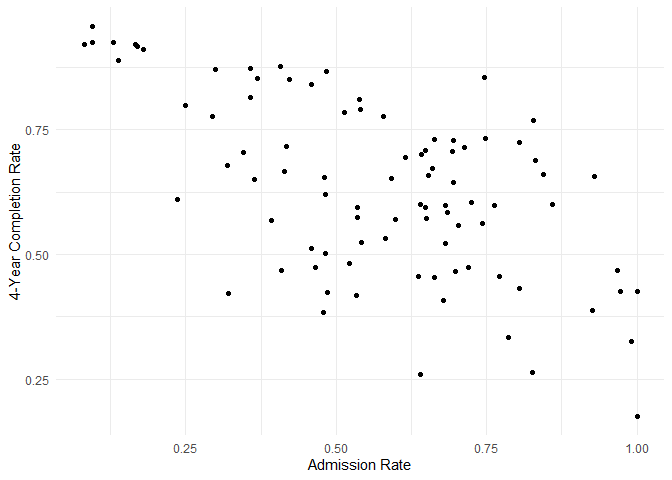
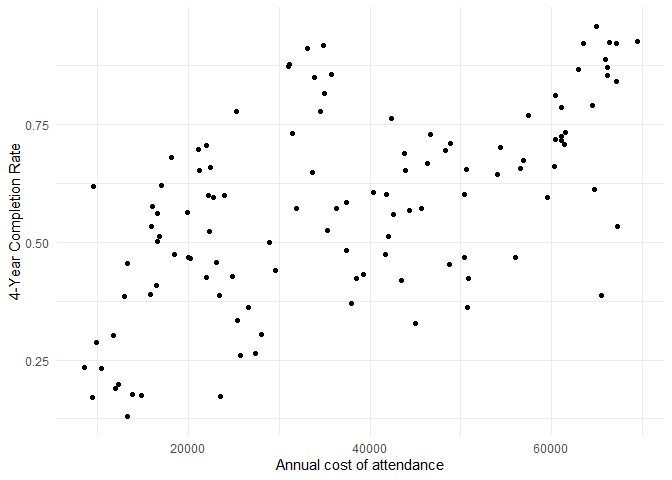
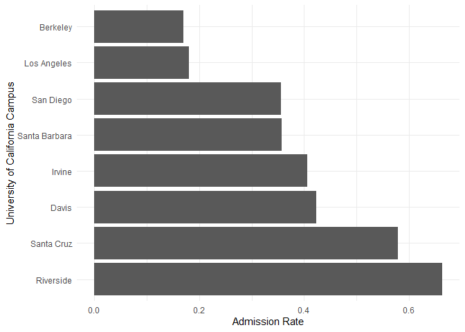
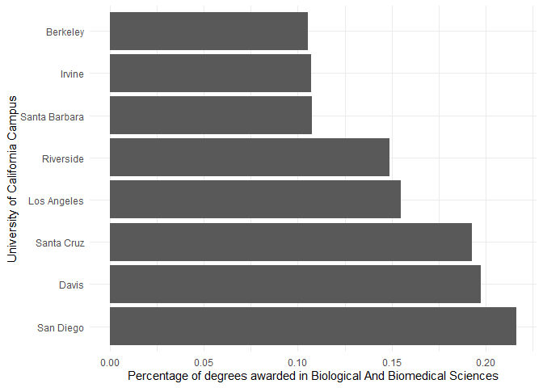

## Instructions
Answer the following questions and complete the exercises in RMarkdown. Please embed all of your code and push your final work to your repository. Your final lab report should be organized, clean, and run free from errors. Remember, you must remove the `#` for the included code chunks to run. Be sure to add your name to the author header above.  

Make sure to use the formatting conventions of RMarkdown to make your report neat and clean!  

## Load the libraries

```r
library(tidyverse)
library(janitor)
library(here)
library(naniar)
library(skimr)
```

For this homework, we will take a departure from biological data and use data about California colleges. These data are a subset of the national college scorecard (https://collegescorecard.ed.gov/data/). Load the `ca_college_data.csv` as a new object called `colleges`.

```r
colleges <- read_csv("../lab9/data/ca_college_data.csv") %>% clean_names()
```

```
## Rows: 341 Columns: 10
```

```
## -- Column specification --------------------------------------------------------
## Delimiter: ","
## chr (4): INSTNM, CITY, STABBR, ZIP
## dbl (6): ADM_RATE, SAT_AVG, PCIP26, COSTT4_A, C150_4_POOLED, PFTFTUG1_EF
```

```
## 
## i Use `spec()` to retrieve the full column specification for this data.
## i Specify the column types or set `show_col_types = FALSE` to quiet this message.
```

The variables are a bit hard to decipher, here is a key:  

INSTNM: Institution name  
CITY: California city  
STABBR: Location state  
ZIP: Zip code  
ADM_RATE: Admission rate  
SAT_AVG: SAT average score  
PCIP26: Percentage of degrees awarded in Biological And Biomedical Sciences  
COSTT4_A: Annual cost of attendance  
C150_4_POOLED: 4-year completion rate  
PFTFTUG1_EF: Percentage of undergraduate students who are first-time, full-time degree/certificate-seeking undergraduate students  

1. Use your preferred function(s) to have a look at the data and get an idea of its structure. Make sure you summarize NA's and determine whether or not the data are tidy. You may also consider dealing with any naming issues.

The California college data set is tidy and stores NA's as `NA`.

```r
colleges %>% skim()
```


Table: Data summary

|                         |           |
|:------------------------|:----------|
|Name                     |Piped data |
|Number of rows           |341        |
|Number of columns        |10         |
|_______________________  |           |
|Column type frequency:   |           |
|character                |4          |
|numeric                  |6          |
|________________________ |           |
|Group variables          |None       |


**Variable type: character**

|skim_variable | n_missing| complete_rate| min| max| empty| n_unique| whitespace|
|:-------------|---------:|-------------:|---:|---:|-----:|--------:|----------:|
|instnm        |         0|             1|  10|  63|     0|      341|          0|
|city          |         0|             1|   4|  19|     0|      161|          0|
|stabbr        |         0|             1|   2|   2|     0|        3|          0|
|zip           |         0|             1|   5|  10|     0|      324|          0|


**Variable type: numeric**

|skim_variable | n_missing| complete_rate|     mean|       sd|      p0|      p25|      p50|      p75|     p100|hist                                     |
|:-------------|---------:|-------------:|--------:|--------:|-------:|--------:|--------:|--------:|--------:|:----------------------------------------|
|adm_rate      |       240|          0.30|     0.59|     0.23|    0.08|     0.46|     0.64|     0.75|     1.00|▂▃▆▇▃ |
|sat_avg       |       276|          0.19|  1112.31|   170.80|  870.00|   985.00|  1078.00|  1237.00|  1555.00|▇▇▅▂▂ |
|pcip26        |        35|          0.90|     0.02|     0.04|    0.00|     0.00|     0.00|     0.02|     0.22|▇▁▁▁▁ |
|costt4_a      |       124|          0.64| 26685.17| 18122.70| 7956.00| 12578.00| 16591.00| 39289.00| 69355.00|▇▂▂▁▂ |
|c150_4_pooled |       221|          0.35|     0.57|     0.21|    0.06|     0.43|     0.58|     0.72|     0.96|▂▃▇▇▅ |
|pftftug1_ef   |        53|          0.84|     0.56|     0.29|    0.01|     0.32|     0.50|     0.81|     1.00|▃▇▆▅▇ |


```r
colleges %>% head()
```

```
## # A tibble: 6 x 10
##   instnm     city   stabbr zip    adm_rate sat_avg pcip26 costt4_a c150_4_pooled
##   <chr>      <chr>  <chr>  <chr>     <dbl>   <dbl>  <dbl>    <dbl>         <dbl>
## 1 Grossmont~ El Ca~ CA     92020~       NA      NA 0.0016     7956            NA
## 2 College o~ Visal~ CA     93277~       NA      NA 0.0066     8109            NA
## 3 College o~ San M~ CA     94402~       NA      NA 0.0038     8278            NA
## 4 Ventura C~ Ventu~ CA     93003~       NA      NA 0.0035     8407            NA
## 5 Oxnard Co~ Oxnard CA     93033~       NA      NA 0.0085     8516            NA
## 6 Moorpark ~ Moorp~ CA     93021~       NA      NA 0.0151     8577            NA
## # ... with 1 more variable: pftftug1_ef <dbl>
```


```r
colleges %>% tail()
```

```
## # A tibble: 6 x 10
##   instnm      city   stabbr zip   adm_rate sat_avg pcip26 costt4_a c150_4_pooled
##   <chr>       <chr>  <chr>  <chr>    <dbl>   <dbl>  <dbl>    <dbl>         <dbl>
## 1 Waynes Col~ Salin~ CA     9390~   NA          NA      0       NA            NA
## 2 Carrington~ Sacra~ CA     95826    0.459      NA      0       NA            NA
## 3 Westminste~ Escon~ CA     92027   NA          NA     NA       NA            NA
## 4 The Wright~ Berke~ CA     9470~   NA          NA     NA       NA            NA
## 5 Western St~ Irvine CA     9261~   NA          NA     NA       NA            NA
## 6 Thomas Jef~ San D~ CA     92101   NA          NA     NA       NA            NA
## # ... with 1 more variable: pftftug1_ef <dbl>
```


```r
colleges %>% 
  miss_var_summary()
```

```
## # A tibble: 10 x 3
##    variable      n_miss pct_miss
##    <chr>          <int>    <dbl>
##  1 sat_avg          276     80.9
##  2 adm_rate         240     70.4
##  3 c150_4_pooled    221     64.8
##  4 costt4_a         124     36.4
##  5 pftftug1_ef       53     15.5
##  6 pcip26            35     10.3
##  7 instnm             0      0  
##  8 city               0      0  
##  9 stabbr             0      0  
## 10 zip                0      0
```


2. Which cities in California have the highest number of colleges?

The top 5 cities with the highest number of colleges is reported below.

```r
colleges %>% 
  group_by(city) %>% 
  count(instnm) %>% 
  summarize(n = sum(n)) %>% 
  arrange(desc(n)) %>% 
  head(n = 5)
```

```
## # A tibble: 5 x 2
##   city              n
##   <chr>         <int>
## 1 Los Angeles      24
## 2 San Diego        18
## 3 San Francisco    15
## 4 Sacramento       10
## 5 Berkeley          9
```

3. Based on your answer to #2, make a plot that shows the number of colleges in the top 10 cities.

```r
# colleges in the top 10 cities
top_10_cities <- colleges %>% 
  group_by(city) %>% 
  count(instnm) %>% 
  summarize(n = sum(n)) %>% 
  arrange(desc(n)) %>% 
  head(n = 10)

# convert city to factor to set y-axis order in the plot
top_10_cities <- top_10_cities %>% 
  mutate(city = factor(city, levels = c(as.vector(top_10_cities$city))))

ggplot(data = top_10_cities) +
  geom_col(aes(x = n, y = city)) +
  labs(x = "Number of Colleges", y = "City") +
  theme_minimal()
```

<!-- -->

4. The column `COSTT4_A` is the annual cost of each institution. Which city has the highest average cost? Where is it located?

Colleges in Claremont have the highest average cost compared to colleges in other cities in California. Claremont is located on the eastern edge of Los Angeles County.

```r
colleges %>% 
  group_by(city) %>% 
  summarize(average_cost = mean(costt4_a, na.rm = T)) %>% 
  top_n(1, average_cost)
```

```
## # A tibble: 1 x 2
##   city      average_cost
##   <chr>            <dbl>
## 1 Claremont        66498
```

5. Based on your answer to #4, make a plot that compares the cost of the individual colleges in the most expensive city. Bonus! Add UC Davis here to see how it compares :>).

```r
# colleges in Claremont + UC Davis
claremont_colleges <- colleges %>% 
  filter(city == "Claremont" | city == "Davis", !is.na(costt4_a)) %>% 
  group_by(city) %>% 
  select(instnm, city, costt4_a) %>% 
  arrange(desc(costt4_a))

# convert instnm and city to factor to set y-axis order and fill color 
claremont_colleges <- claremont_colleges %>% 
  mutate(instnm = factor(instnm, levels = c(as.vector(claremont_colleges$instnm))),
         city = factor(city))

ggplot(data = claremont_colleges) +
  geom_col(aes(x = costt4_a, y = instnm, fill = city)) +
  labs(x = "Annual Cost of Attendance", y = "Institution Name") +
  scale_fill_discrete(name = "City") +
  theme_minimal()
```

<!-- -->

6. The column `ADM_RATE` is the admissions rate by college and `C150_4_POOLED` is the four-year completion rate. Use a scatterplot to show the relationship between these two variables. What do you think this means?

The scatterplot of `adm_rate` and `c150_4_pooled` shows a negative association between admission rate and 4-year completion rate. In general, students at institutions with high admission rates are less likely to graduate in 4 years than students at institutions with low admission rates.

```r
adm_comp_rates <- colleges %>% 
  filter(!is.na(adm_rate), !is.na(c150_4_pooled)) %>% 
  select(instnm, adm_rate, c150_4_pooled)

ggplot(data = adm_comp_rates) +
  geom_point(aes(x = adm_rate, y = c150_4_pooled)) +
  labs(x = "Admission Rate", y = "4-Year Completion Rate") +
  theme_minimal()
```

<!-- -->

7. Is there a relationship between cost and four-year completion rate? (You don't need to do the stats, just produce a plot). What do you think this means?

There is somewhat of a positive relationship between cost and 4-year completion rate. In general, students at the most expensive schools are more likely to graduate in 4 years than students at the least expensive schools. However, for most institutions, cost does not appear to predict 4-year completion rate. 

```r
cost_comp_rate <- colleges %>% 
  filter(!is.na(costt4_a), !is.na(c150_4_pooled)) %>% 
  select(instnm, costt4_a, c150_4_pooled)

ggplot(data = cost_comp_rate) + 
  geom_point(aes(x = costt4_a, y = c150_4_pooled)) +
  labs(x = "Annual cost of attendance", y = "4-Year Completion Rate") +
  theme_minimal()
```

<!-- -->

8. The column titled `INSTNM` is the institution name. We are only interested in the University of California colleges. Make a new data frame that is restricted to UC institutions. You can remove `Hastings College of Law` and `UC San Francisco` as we are only interested in undergraduate institutions.

```r
# find indices of uc institutions
all_instnm <- colleges$instnm %>% sort()

# use indices to select UC names
uc_names <- all_instnm[309:318]
```

Remove `Hastings College of Law` and `UC San Francisco` and store the final data frame as a new object `univ_calif_final`.

```r
univ_calif_final <- colleges %>% 
  filter(instnm %in% uc_names) %>% 
  slice(1:8)
```

Use `separate()` to separate institution name into two new columns "UNIV" and "CAMPUS".

```r
univ_calif_final <- univ_calif_final %>% 
  separate(instnm, into = c("univ", "campus"), sep = "-")

univ_calif_final
```

```
## # A tibble: 8 x 11
##   univ  campus city  stabbr zip   adm_rate sat_avg pcip26 costt4_a c150_4_pooled
##   <chr> <chr>  <chr> <chr>  <chr>    <dbl>   <dbl>  <dbl>    <dbl>         <dbl>
## 1 Univ~ San D~ La J~ CA     92093    0.357    1324  0.216    31043         0.872
## 2 Univ~ Irvine Irvi~ CA     92697    0.406    1206  0.107    31198         0.876
## 3 Univ~ River~ Rive~ CA     92521    0.663    1078  0.149    31494         0.73 
## 4 Univ~ Los A~ Los ~ CA     9009~    0.180    1334  0.155    33078         0.911
## 5 Univ~ Davis  Davis CA     9561~    0.423    1218  0.198    33904         0.850
## 6 Univ~ Santa~ Sant~ CA     9506~    0.578    1201  0.193    34608         0.776
## 7 Univ~ Berke~ Berk~ CA     94720    0.169    1422  0.105    34924         0.916
## 8 Univ~ Santa~ Sant~ CA     93106    0.358    1281  0.108    34998         0.816
## # ... with 1 more variable: pftftug1_ef <dbl>
```

9. The column `ADM_RATE` is the admissions rate by campus. Which UC has the lowest and highest admissions rates? Produce a numerical summary and an appropriate plot.

UC Riverside has the highest admission rate and UC Berkeley has the lowest admission rate.

```r
uc_adm_rate <- univ_calif_final %>% 
  select(campus, adm_rate) %>% 
  arrange(desc(adm_rate))

uc_adm_rate
```

```
## # A tibble: 8 x 2
##   campus        adm_rate
##   <chr>            <dbl>
## 1 Riverside        0.663
## 2 Santa Cruz       0.578
## 3 Davis            0.423
## 4 Irvine           0.406
## 5 Santa Barbara    0.358
## 6 San Diego        0.357
## 7 Los Angeles      0.180
## 8 Berkeley         0.169
```


```r
uc_adm_rate <- uc_adm_rate %>% 
  mutate(campus = factor(campus, levels = c(as.vector(uc_adm_rate$campus))))

ggplot(data = uc_adm_rate) + 
  geom_col(aes(x = adm_rate, y = campus)) +
  labs(x = "Admission Rate", y = "University of California Campus") +
  theme_minimal()
```

<!-- -->

10. If you wanted to get a degree in biological or biomedical sciences, which campus confers the majority of these degrees? Produce a numerical summary and an appropriate plot.

UCSD confers the highest percentage of degrees in biological or biomedical sciences.

```r
uc_bio <- univ_calif_final %>% 
  select(campus, pcip26) %>% 
  arrange(desc(pcip26))

uc_bio
```

```
## # A tibble: 8 x 2
##   campus        pcip26
##   <chr>          <dbl>
## 1 San Diego      0.216
## 2 Davis          0.198
## 3 Santa Cruz     0.193
## 4 Los Angeles    0.155
## 5 Riverside      0.149
## 6 Santa Barbara  0.108
## 7 Irvine         0.107
## 8 Berkeley       0.105
```


```r
uc_bio <- uc_bio %>% 
  mutate(campus = factor(campus, levels = c(as.vector(uc_bio$campus))))

ggplot(data = uc_bio) +
  geom_col(aes(x = pcip26, y = campus)) +
  labs(x = "Percentage of degrees awarded in Biological And Biomedical Sciences", 
       y = "University of California Campus") +
  theme_minimal()
```

<!-- -->

## Knit Your Output and Post to [GitHub](https://github.com/FRS417-DataScienceBiologists)
