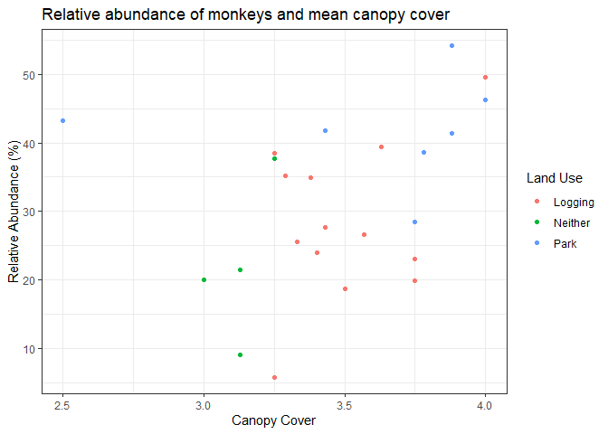

## Instructions
Answer the following questions and complete the exercises in RMarkdown. Please embed all of your code and push your final work to your repository. Your code should be organized, clean, and run free from errors. Remember, you must remove the `#` for any included code chunks to run. Be sure to add your name to the author header above. You may use any resources to answer these questions (including each other), but you may not post questions to Open Stacks or external help sites. There are 15 total questions, each is worth 2 points.  

Make sure to use the formatting conventions of RMarkdown to make your report neat and clean!  

This exam is due by 12:00p on Thursday, January 27.  

## Load the tidyverse
If you plan to use any other libraries to complete this assignment then you should load them here.

```r
library(tidyverse)
library(skimr)
library(janitor)
```

## Questions  
Wikipedia's definition of [data science](https://en.wikipedia.org/wiki/Data_science): "Data science is an interdisciplinary field that uses scientific methods, processes, algorithms and systems to extract knowledge and insights from noisy, structured and unstructured data, and apply knowledge and actionable insights from data across a broad range of application domains."  

1. (2 points) Consider the definition of data science above. Although we are only part-way through the quarter, what specific elements of data science do you feel we have practiced? Provide at least one specific example.  

We have practiced extracting knowledge and insights from noisy, structured, and unstructured data. For example, in lab 5 we practiced using dplyr functions such as `filter()`, `select()`, `mutate()`, and `arrange()` to manipulate the superheros data set and to extract different information.

2. (2 points) What is the most helpful or interesting thing you have learned so far in BIS 15L? What is something that you think needs more work or practice?  

The most interesting thing I have learned so far in BIS 15L is how to use dplyr's `across()` function. I think it would be useful to practice using iteration.

In the midterm 1 folder there is a second folder called `data`. Inside the `data` folder, there is a .csv file called `ElephantsMF`. These data are from Phyllis Lee, Stirling University, and are related to Lee, P., et al. (2013), "Enduring consequences of early experiences: 40-year effects on survival and success among African elephants (Loxodonta africana)," Biology Letters, 9: 20130011. [kaggle](https://www.kaggle.com/mostafaelseidy/elephantsmf).  

3. (2 points) Please load these data as a new object called `elephants`. Use the function(s) of your choice to get an idea of the structure of the data. Be sure to show the class of each variable.

```r
elephants <- read_csv("data/ElephantsMF.csv")
```

```
## Rows: 288 Columns: 3
```

```
## -- Column specification --------------------------------------------------------
## Delimiter: ","
## chr (1): Sex
## dbl (2): Age, Height
```

```
## 
## i Use `spec()` to retrieve the full column specification for this data.
## i Specify the column types or set `show_col_types = FALSE` to quiet this message.
```

The `elephants` data set has one character variable (`Sex`), and two numeric variables (`Age` and `Height`).

```r
elephants %>% skim()
```


Table: Data summary

|                         |           |
|:------------------------|:----------|
|Name                     |Piped data |
|Number of rows           |288        |
|Number of columns        |3          |
|_______________________  |           |
|Column type frequency:   |           |
|character                |1          |
|numeric                  |2          |
|________________________ |           |
|Group variables          |None       |


**Variable type: character**

|skim_variable | n_missing| complete_rate| min| max| empty| n_unique| whitespace|
|:-------------|---------:|-------------:|---:|---:|-----:|--------:|----------:|
|Sex           |         0|             1|   1|   1|     0|        2|          0|


**Variable type: numeric**

|skim_variable | n_missing| complete_rate|   mean|   sd|    p0|    p25|    p50|    p75|   p100|hist                                     |
|:-------------|---------:|-------------:|------:|----:|-----:|------:|------:|------:|------:|:----------------------------------------|
|Age           |         0|             1|  10.97|  8.4|  0.01|   4.58|   9.46|  16.50|  32.17|▆▇▂▂▂ |
|Height        |         0|             1| 187.68| 50.6| 75.46| 160.75| 200.00| 221.09| 304.06|▃▃▇▇▁ |

4. (2 points) Change the names of the variables to lower case and change the class of the variable `sex` to a factor.

```r
elephants <- elephants %>% 
  clean_names() %>% 
  mutate(across(sex, as.factor))
```

5. (2 points) How many male and female elephants are represented in the data?

150 male and 138 female elephants are represented in the data.

```r
elephants %>% count(sex)
```

```
## # A tibble: 2 x 2
##   sex       n
##   <fct> <int>
## 1 F       150
## 2 M       138
```


6. (2 points) What is the average age all elephants in the data?

The average age of all elephants in the data is 10.97132 years.

```r
elephants %>% 
  summarize(average_age_yrs = mean(age))
```

```
## # A tibble: 1 x 1
##   average_age_yrs
##             <dbl>
## 1            11.0
```


7. (2 points) How does the average age and height of elephants compare by sex?

```r
elephants %>% 
  group_by(sex) %>% 
  summarize(average_age_yrs = mean(age),
            average_height_cm = mean(height))
```

```
## # A tibble: 2 x 3
##   sex   average_age_yrs average_height_cm
##   <fct>           <dbl>             <dbl>
## 1 F               12.8               190.
## 2 M                8.95              185.
```


8. (2 points) How does the average height of elephants compare by sex for individuals over 20 years old. Include the min and max height as well as the number of individuals in the sample as part of your analysis.  

```r
elephants %>% 
  filter(age > 20) %>% 
  group_by(sex) %>% 
  summarize(min_height_cm = min(height),
            max_height_cm = max(height),
            average_height_cm = mean(height),
            n = n())
```

```
## # A tibble: 2 x 5
##   sex   min_height_cm max_height_cm average_height_cm     n
##   <fct>         <dbl>         <dbl>             <dbl> <int>
## 1 F              193.          278.              232.    37
## 2 M              229.          304.              270.    13
```

For the next series of questions, we will use data from a study on vertebrate community composition and impacts from defaunation in [Gabon, Africa](https://en.wikipedia.org/wiki/Gabon). One thing to notice is that the data include 24 separate transects. Each transect represents a path through different forest management areas.  

Reference: Koerner SE, Poulsen JR, Blanchard EJ, Okouyi J, Clark CJ. Vertebrate community composition and diversity declines along a defaunation gradient radiating from rural villages in Gabon. _Journal of Applied Ecology_. 2016. This paper, along with a description of the variables is included inside the midterm 1 folder.  

9. (2 points) Load `IvindoData_DryadVersion.csv` and use the function(s) of your choice to get an idea of the overall structure. Change the variables `HuntCat` and `LandUse` to factors.

```r
gabon <- read_csv("data/IvindoData_DryadVersion.csv") %>%
  mutate(across(c(HuntCat, LandUse), as.factor))
```

```
## Rows: 24 Columns: 26
```

```
## -- Column specification --------------------------------------------------------
## Delimiter: ","
## chr  (2): HuntCat, LandUse
## dbl (24): TransectID, Distance, NumHouseholds, Veg_Rich, Veg_Stems, Veg_lian...
```

```
## 
## i Use `spec()` to retrieve the full column specification for this data.
## i Specify the column types or set `show_col_types = FALSE` to quiet this message.
```

```r
gabon %>% skim()
```


Table: Data summary

|                         |           |
|:------------------------|:----------|
|Name                     |Piped data |
|Number of rows           |24         |
|Number of columns        |26         |
|_______________________  |           |
|Column type frequency:   |           |
|factor                   |2          |
|numeric                  |24         |
|________________________ |           |
|Group variables          |None       |


**Variable type: factor**

|skim_variable | n_missing| complete_rate|ordered | n_unique|top_counts              |
|:-------------|---------:|-------------:|:-------|--------:|:-----------------------|
|HuntCat       |         0|             1|FALSE   |        3|Non: 9, Mod: 8, Hig: 7  |
|LandUse       |         0|             1|FALSE   |        3|Log: 13, Par: 7, Nei: 4 |


**Variable type: numeric**

|skim_variable           | n_missing| complete_rate|  mean|    sd|    p0|   p25|   p50|   p75|  p100|hist                                     |
|:-----------------------|---------:|-------------:|-----:|-----:|-----:|-----:|-----:|-----:|-----:|:----------------------------------------|
|TransectID              |         0|             1| 13.50|  8.51|  1.00|  5.75| 14.50| 20.25| 27.00|▇▃▅▆▆ |
|Distance                |         0|             1| 11.88|  7.28|  2.70|  5.67|  9.72| 17.68| 26.76|▇▂▂▅▂ |
|NumHouseholds           |         0|             1| 37.88| 17.80| 13.00| 24.75| 29.00| 54.00| 73.00|▇▇▂▇▂ |
|Veg_Rich                |         0|             1| 14.83|  2.07| 10.88| 13.10| 14.94| 16.54| 18.75|▃▂▃▇▁ |
|Veg_Stems               |         0|             1| 32.80|  5.96| 23.44| 28.69| 32.44| 37.08| 47.56|▆▇▆▃▁ |
|Veg_liana               |         0|             1| 11.04|  3.29|  4.75|  9.03| 11.94| 13.25| 16.38|▃▂▃▇▃ |
|Veg_DBH                 |         0|             1| 46.09| 10.67| 28.45| 40.65| 43.90| 50.57| 76.48|▂▇▃▁▁ |
|Veg_Canopy              |         0|             1|  3.47|  0.35|  2.50|  3.25|  3.43|  3.75|  4.00|▁▁▇▅▇ |
|Veg_Understory          |         0|             1|  3.02|  0.34|  2.38|  2.88|  3.00|  3.17|  3.88|▂▆▇▂▁ |
|RA_Apes                 |         0|             1|  2.04|  3.03|  0.00|  0.00|  0.48|  3.82| 12.93|▇▂▁▁▁ |
|RA_Birds                |         0|             1| 58.64| 14.71| 31.56| 52.51| 57.89| 68.18| 85.03|▅▅▇▇▃ |
|RA_Elephant             |         0|             1|  0.54|  0.67|  0.00|  0.00|  0.36|  0.89|  2.30|▇▂▂▁▁ |
|RA_Monkeys              |         0|             1| 31.30| 12.38|  5.84| 22.70| 31.74| 39.88| 54.12|▂▅▃▇▂ |
|RA_Rodent               |         0|             1|  3.28|  1.47|  1.06|  2.05|  3.23|  4.09|  6.31|▇▅▇▃▃ |
|RA_Ungulate             |         0|             1|  4.17|  4.31|  0.00|  1.23|  2.54|  5.16| 13.86|▇▂▁▁▂ |
|Rich_AllSpecies         |         0|             1| 20.21|  2.06| 15.00| 19.00| 20.00| 22.00| 24.00|▁▁▇▅▁ |
|Evenness_AllSpecies     |         0|             1|  0.77|  0.05|  0.67|  0.75|  0.78|  0.81|  0.83|▃▁▅▇▇ |
|Diversity_AllSpecies    |         0|             1|  2.31|  0.15|  1.97|  2.25|  2.32|  2.43|  2.57|▂▃▇▆▅ |
|Rich_BirdSpecies        |         0|             1| 10.33|  1.24|  8.00| 10.00| 11.00| 11.00| 13.00|▃▅▇▁▁ |
|Evenness_BirdSpecies    |         0|             1|  0.71|  0.08|  0.56|  0.68|  0.72|  0.77|  0.82|▅▁▇▆▇ |
|Diversity_BirdSpecies   |         0|             1|  1.66|  0.20|  1.16|  1.60|  1.68|  1.78|  2.01|▂▂▅▇▃ |
|Rich_MammalSpecies      |         0|             1|  9.88|  1.68|  6.00|  9.00| 10.00| 11.00| 12.00|▂▂▃▅▇ |
|Evenness_MammalSpecies  |         0|             1|  0.75|  0.06|  0.62|  0.71|  0.74|  0.78|  0.86|▂▃▇▂▅ |
|Diversity_MammalSpecies |         0|             1|  1.70|  0.17|  1.38|  1.57|  1.70|  1.81|  2.06|▅▇▇▇▃ |


10. (4 points) For the transects with high and moderate hunting intensity, how does the average diversity of birds and mammals compare?

```r
gabon %>% 
  filter(HuntCat == "High" | HuntCat == "Moderate") %>% 
  group_by(HuntCat) %>% 
  summarize(average_H_birds = mean(Diversity_BirdSpecies),
            average_H_mammals = mean(Diversity_MammalSpecies))
```

```
## # A tibble: 2 x 3
##   HuntCat  average_H_birds average_H_mammals
##   <fct>              <dbl>             <dbl>
## 1 High                1.66              1.74
## 2 Moderate            1.62              1.68
```


11. (4 points) One of the conclusions in the study is that the relative abundance of animals drops off the closer you get to a village. Let's try to reconstruct this (without the statistics). How does the relative abundance (RA) of apes, birds, elephants, monkeys, rodents, and ungulates compare between sites that are less than 3km from a village to sites that are greater than 25km from a village? The variable `Distance` measures the distance of the transect from the nearest village. Hint: try using the `across` operator.  

The average relative abundance of apes, birds, elephants, monkeys, rodents, and ungulates for sites that are less than 3km and for sites that are greater than 25km from a village are reported below. The average relative abundances of apes, monkeys, and ungulates at sites that are less than 3 km from a village are less than the average relative abundances at sites greater than 25 km from a village. In contrast, the average relative abundances of birds, elephants, and rodents is greater at sites less than 3 km from a village than at sites greater than 25 km from a village.

```r
# Sites < 3km from a village
gabon %>% 
  filter(Distance < 3) %>% 
  summarize(across(starts_with("RA"), mean))
```

```
## # A tibble: 1 x 6
##   RA_Apes RA_Birds RA_Elephant RA_Monkeys RA_Rodent RA_Ungulate
##     <dbl>    <dbl>       <dbl>      <dbl>     <dbl>       <dbl>
## 1    0.12     76.6       0.145       17.3      3.90        1.87
```


```r
# Sites > 25km from a village 
gabon %>% 
  filter(Distance > 25) %>% 
  summarize(across(starts_with("RA"), mean))
```

```
## # A tibble: 1 x 6
##   RA_Apes RA_Birds RA_Elephant RA_Monkeys RA_Rodent RA_Ungulate
##     <dbl>    <dbl>       <dbl>      <dbl>     <dbl>       <dbl>
## 1    4.91     31.6           0       54.1      1.29        8.12
```

12. (4 points) Based on your interest, do one exploratory analysis on the `gabon` data of your choice. This analysis needs to include a minimum of two functions in `dplyr.`

I am interested in comparing the relative abundance of monkeys across land use categories and determining whether the relative abundance of monkeys is greater in transects with more canopy cover. Therefore, my analysis focuses on the following variables:

* `LandUse`: Broad land use categories 
  + Park = Inside National Park
  + Logging = Inside a logging concession
  + Neither = Neither inside a park or a logging concession

* `RA_Monkeys`: Relative abundance of monkeys (%)

* `Veg_Canopy`: Mean canopy cover in 78.5 m^2^ plots (n = 8 per transect) 
  + 0 = open canopy cover 
  + 4 = 100% canopy cover (i.e., closed canopy)

Using dyplr's `group_by()` and `summarize()`, and `arrange()` functions, we can compare the average relative abundance of monkeys and canopy cover across land use categories. The relative abundance of monkeys is the greatest inside national parks, which have the greatest mean canopy cover compared to the other land use categories. The average relative abundance of monkeys appears to have a positive association with mean canopy cover. 

```r
gabon %>% 
  group_by(LandUse) %>% 
  summarize(across(c(RA_Monkeys, Veg_Canopy), mean)) %>% 
  arrange(desc(RA_Monkeys))
```

```
## # A tibble: 3 x 3
##   LandUse RA_Monkeys Veg_Canopy
##   <fct>        <dbl>      <dbl>
## 1 Park          42.0       3.60
## 2 Logging       28.4       3.50
## 3 Neither       22.1       3.13
```
A scatterplot of the relative abundance of monkeys and the mean canopy cover in each transect shows the positive association between relative abundance and canopy coverage.

```r
ggplot(data = gabon) +
  geom_point(mapping = aes(x = Veg_Canopy, y = RA_Monkeys, color = LandUse)) +
  labs(x = "Canopy Cover", 
       y = "Relative Abundance (%)", 
       color = "Land Use",
       title = "Relative abundance of monkeys and mean canopy cover") +
   theme_bw()
```

<!-- -->
