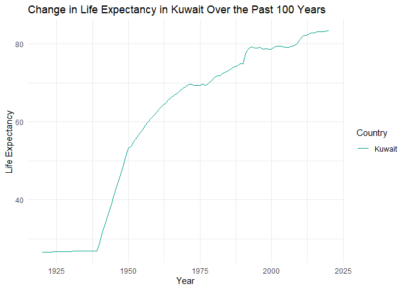
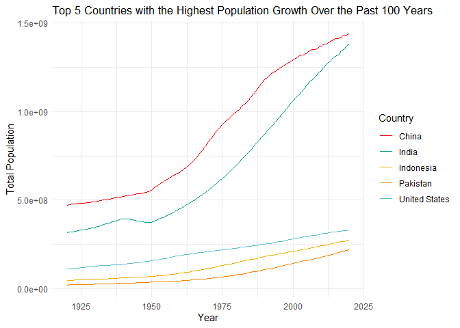
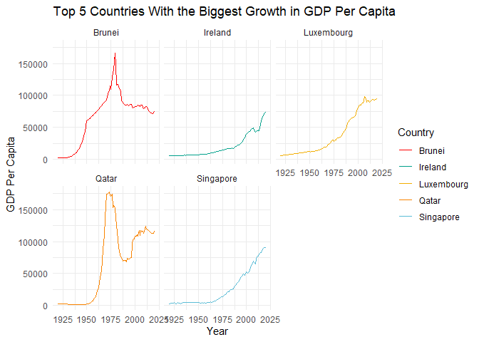
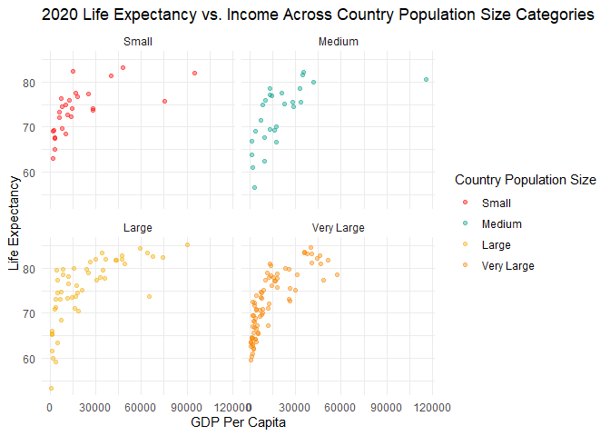

## Instructions
Answer the following questions and complete the exercises in RMarkdown. Please embed all of your code and push your final work to your repository. Your code should be organized, clean, and run free from errors. Be sure to **add your name** to the author header above. You may use any resources to answer these questions (including each other), but you may not post questions to Open Stacks or external help sites. There are 10 total questions.  

Make sure to use the formatting conventions of RMarkdown to make your report neat and clean! Your plots should use consistent aesthetics throughout.  

This exam is due by **12:00p on Tuesday, February 22**.  

## Gapminder
For this assignment, we are going to use data from  [gapminder](https://www.gapminder.org/). Gapminder includes information about economics, population, social issues, and life expectancy from countries all over the world. We will use three data sets, so please load all three as separate objects.    

1. population_total.csv  
2. income_per_person_gdppercapita_ppp_inflation_adjusted.csv  
3. life_expectancy_years.csv  

1. (3 points) Once you have an idea of the structure of the data, please make each data set tidy (hint: think back to pivots) and store them as new objects. You will need both the original (wide) and tidy (long) data!  

All data sets are wide with years spread across columns, so they are not tidy. To make the data sets tidy, they must be pivoted longer.

```r
# population_total.csv:

pop <- read_csv("data/population_total.csv") %>% 
  clean_names()

# pop %>% head()
# Years are spread across columns
pop_tidy <- pop %>% 
  pivot_longer(-country, 
               names_to = "year", 
               values_to = "total_pop")

# pop %>% any_NA
# no missing values
```


```r
# income_per_person_gdppercapita_ppp_inflation_adjusted.csv:

income <- read_csv("data/income_per_person_gdppercapita_ppp_inflation_adjusted.csv") %>% 
  clean_names()

# income %>% head()
# Years are spread across columns

income_tidy <- income %>% 
  pivot_longer(-country,
               names_to = "year",
               values_to = "income")

# income %>% anyNA()
# no missing values
```


```r
# life_expectancy_years.csv:

life_exp <- read_csv("data/life_expectancy_years.csv") %>% 
  clean_names()

# life_exp %>% head()
# Years are spread across columns
life_exp_tidy <- life_exp %>% 
  pivot_longer(-country,
               names_to = "year",
               values_to = "life_exp")

# life_exp %>% anyNA()
# life_exp %>% is.na() %>% sum()
# 759 missing values
```


2. (1 point) How many different countries are represented in the data? Provide the total number and their names. Since each data set includes different numbers of countries, you will need to do this for each one.

In the population_total.csv data set, 195 countries are represented. In the income_per_person_gdppercapita_ppp_inflation_adjusted.csv data set, 193 countries are represented. In the life_expectancy_years.csv data set, 187 countries are represented. The names of the countries represented in each data set are listed below.


```r
# Define countries function to determine number and names of different countries in each data set.
countries <- function(x){
  x %>% 
    select(country) %>% 
    unique()
}

# Create a list to contain all data sets.
df_list <- list(pop_tidy, income_tidy, life_exp_tidy)

# Apply countries function to list of data frames.
df_list %>% 
  lapply(countries)
```

```
## [[1]]
## # A tibble: 195 x 1
##    country            
##    <chr>              
##  1 Afghanistan        
##  2 Albania            
##  3 Algeria            
##  4 Andorra            
##  5 Angola             
##  6 Antigua and Barbuda
##  7 Argentina          
##  8 Armenia            
##  9 Australia          
## 10 Austria            
## # ... with 185 more rows
## 
## [[2]]
## # A tibble: 193 x 1
##    country            
##    <chr>              
##  1 Afghanistan        
##  2 Albania            
##  3 Algeria            
##  4 Andorra            
##  5 Angola             
##  6 Antigua and Barbuda
##  7 Argentina          
##  8 Armenia            
##  9 Australia          
## 10 Austria            
## # ... with 183 more rows
## 
## [[3]]
## # A tibble: 187 x 1
##    country            
##    <chr>              
##  1 Afghanistan        
##  2 Albania            
##  3 Algeria            
##  4 Andorra            
##  5 Angola             
##  6 Antigua and Barbuda
##  7 Argentina          
##  8 Armenia            
##  9 Australia          
## 10 Austria            
## # ... with 177 more rows
```


## Life Expectancy  

3. (2 points) Let's limit the data to 100 years (1920-2020). For these years, which country has the highest average life expectancy? How about the lowest average life expectancy?  

The average life expectancy for each country limited to the 100 years between 1920 - 2020 is reported below.

```r
years <- c(1920:2020)

avg_life_exp <- life_exp_tidy %>% 
  mutate(year = str_replace(year, "x", ""),
         year = as.numeric(year)) %>%
  filter(year %in% years, 
         !is.na(life_exp)) %>% 
  mutate(year = factor(year)) %>% 
  group_by(country) %>% 
  summarize(avg_life_exp = mean(life_exp)) %>% 
  arrange(desc(avg_life_exp))
  
avg_life_exp
```

```
## # A tibble: 187 x 2
##    country     avg_life_exp
##    <chr>              <dbl>
##  1 Andorra             79.8
##  2 Sweden              73.5
##  3 Norway              73.2
##  4 Netherlands         73.0
##  5 Dominica            73.0
##  6 Iceland             72.9
##  7 Australia           72.7
##  8 Switzerland         72.7
##  9 Denmark             71.9
## 10 Canada              71.8
## # ... with 177 more rows
```
For these years, the country with the highest average life expectancy is Andorra and the country with the lowest average life expectancy is Central African Republic.

```r
rbind(avg_life_exp %>% head(1), 
      avg_life_exp %>% tail(1))
```

```
## # A tibble: 2 x 2
##   country                  avg_life_exp
##   <chr>                           <dbl>
## 1 Andorra                          79.8
## 2 Central African Republic         41.8
```


4. (3 points) Although we can see which country has the highest life expectancy for the past 100 years, we don't know which countries have changed the most. What are the top 5 countries that have experienced the biggest improvement in life expectancy between 1920-2020?  

The top 5 countries that have experienced the biggest improvement in life expectancy between 1920-2020 are reported below.

```r
life_exp_change <- life_exp_tidy %>% 
  slice(which(c(year == "x1920" | year == "x2020"))) %>% 
  filter(!is.na(life_exp)) %>% 
  pivot_wider(names_from = "year", values_from = "life_exp") %>% 
  mutate(change = x2020 - x1920) %>% 
  arrange(desc(change))

life_exp_change %>% 
  head(5)
```

```
## # A tibble: 5 x 4
##   country         x1920 x2020 change
##   <chr>           <dbl> <dbl>  <dbl>
## 1 Kuwait           26.6  83.4   56.8
## 2 Kyrgyz Republic  16.6  73.1   56.5
## 3 Turkmenistan     15.2  70.5   55.3
## 4 South Korea      28.2  83.2   55  
## 5 Tajikistan       16.7  71     54.3
```


5. (3 points) Make a plot that shows the change over the past 100 years for the country with the biggest improvement in life expectancy. Be sure to add appropriate aesthetics to make the plot clean and clear. Once you have made the plot, do a little internet searching and see if you can discover what historical event may have contributed to this remarkable change.  

Kuwait had the biggest improvement in life expectancy over the past 100 years. According to the [Borgen Project](https://borgenproject.org/10-facts-about-life-expectancy-in-kuwait/), life expectancy in Kuwait increased rapidly in the 1960s because the development of the petroleum industry and the resulting economic development increased wealth and standard of living in the country. 

```r
# Kuwait had the biggest improvement in life expectancy over the past 100 years
kuwait <- life_exp_tidy %>%
  mutate(year = str_replace(year, "x", ""),
         year = as.numeric(year)) %>%
  filter(year %in% years, 
         !is.na(life_exp),
         country == "Kuwait")

pal <- wes_palettes$Darjeeling1

ggplot(data = kuwait) +
  geom_line(aes(x = year, y = life_exp, color = country)) +
  labs(x = "Year",
       y = "Life Expectancy",
       title = "Change in Life Expectancy in Kuwait Over the Past 100 Years",
       color = "Country") +
  scale_color_manual(values = pal[2]) +
  theme_minimal()
```

<!-- -->


## Population Growth
6. (3 points) Which 5 countries have had the highest population growth over the past 100 years (1920-2020)?

The top 5 countries with the highest population growth over the past 100 years are reported below.

```r
pop_change <- pop_tidy %>% 
  mutate(year = str_replace(year, "x", ""),
         year = as.numeric(year)) %>%
  filter(year %in% years) %>% 
  pivot_wider(names_from = "year", values_from = "total_pop") %>% 
  mutate(change = `2020` - `1920`) %>% 
  select(c(country, change)) %>% 
  arrange(desc(change))

pop_change %>% head(5)
```

```
## # A tibble: 5 x 2
##   country           change
##   <chr>              <dbl>
## 1 India         1063000000
## 2 China          968000000
## 3 Indonesia      226700000
## 4 United States  220000000
## 5 Pakistan       199300000
```

7. (4 points) Produce a plot that shows the 5 countries that have had the highest population growth over the past 100 years (1920-2020). Which countries appear to have had exponential growth? 

China and India appear to have had exponential growth.   

```r
top_5_pop_growth <- pop_change$country %>% 
  head(5) %>%  
  as.vector()

highest_pop_growth <- pop_tidy %>% 
  mutate(year = str_replace(year, "x", ""),
         year = as.numeric(year)) %>%
  filter(year %in% years, 
         country %in% top_5_pop_growth)
  
ggplot(data = highest_pop_growth) +
  geom_line(aes(x = year, y = total_pop, color = country)) +
  labs(x = "Year", 
       y = "Total Population",
       color = "Country",
       title = "Top 5 Countries with the Highest Population Growth Over the Past 100 Years") +
  scale_color_manual(values = pal) +
  theme_minimal() +
  theme(plot.title = element_text(size = 13))
```

<!-- -->

## Income
The units used for income are gross domestic product per person adjusted for differences in purchasing power in international dollars.

8. (4 points) As in the previous questions, which countries have experienced the biggest growth in per person GDP. Show this as a table and then plot the changes for the top 5 countries. With a bit of research, you should be able to explain the dramatic downturns of the wealthiest economies that occurred during the 1980's.  

The countries with the biggest growth in per person GDP are reported below.

```r
income_change <- income_tidy %>% 
  mutate(year = str_replace(year, "x", ""),
         year = as.numeric(year)) %>%
  filter(year %in% years) %>% 
  pivot_wider(names_from = "year", values_from = "income") %>% 
  mutate(change = `2020` - `1920`) %>% 
  select(c(country, change)) %>% 
  arrange(desc(change))

income_change %>% head(5)
```

```
## # A tibble: 5 x 2
##   country    change
##   <chr>       <dbl>
## 1 Qatar      113700
## 2 Luxembourg  89370
## 3 Singapore   88060
## 4 Brunei      72970
## 5 Ireland     68930
```

The dramatic downturns of the wealthiest economies in the 1980's occurred due to the 1979 Oil Crisis. The Iranian Revolution caused a decrease in oil production which increased oil prices and initiated worldwide economic recessions.

```r
top_5_gdp_growth <- income_change$country %>% 
  head(5) %>% 
  as.vector()

highest_gdp_growth <- income_tidy %>% 
   mutate(year = str_replace(year, "x", ""),
          year = as.numeric(year)) %>%
  filter(year %in% years, 
         country %in% top_5_gdp_growth)

ggplot(data = highest_gdp_growth) +
  geom_line(aes(x = year, y = income, color = country)) +
  facet_wrap(~country) +
  labs(x = "Year", 
       y = "GDP Per Capita",
       color = "Country",
       title = "Top 5 Countries With the Biggest Growth in GDP Per Capita") +
  scale_color_manual(values = pal) +
  theme_minimal()
```

<!-- -->


9. (3 points) Create three new objects that restrict each data set (life expectancy, population, income) to the years 1920-2020. Hint: I suggest doing this with the long form of your data. Once this is done, merge all three data sets using the code I provide below. You may need to adjust the code depending on how you have named your objects. I called mine `life_expectancy_100`, `population_100`, and `income_100`. For some of you, learning these `joins` will be important for your project.  


```r
# Define restrict_100 function to restrict each data set to the years 1920 - 2020.
restrict_100 <- function(x){
  x %>% 
    mutate(year = str_replace(year, "x", ""),
           year = as.numeric(year)) %>%
    filter(year %in% years) %>%  
    mutate(year = factor(year)) 
}

# Create a list containing all restricted data sets.
df_list_restricted <- df_list %>% 
  lapply(restrict_100)

# Extract each restricted data set from the list.
df_names <- c("population", "income", "life_expectancy")
for (i in 1:3){
  assign(paste(df_names[i], "_100", sep = ""), 
         df_list_restricted[i] %>% 
          as.data.frame())
  }
```


```r
gapminder_join <- inner_join(life_expectancy_100, population_100, by= c("country", "year"))
gapminder_join <- inner_join(gapminder_join, income_100, by= c("country", "year"))

gapminder_join <- gapminder_join %>% 
  as_tibble()

gapminder_join
```

```
## # A tibble: 18,887 x 5
##    country     year  life_exp total_pop income
##    <chr>       <fct>    <dbl>     <dbl>  <dbl>
##  1 Afghanistan 1920      30.6  10600000   1490
##  2 Afghanistan 1921      30.7  10500000   1520
##  3 Afghanistan 1922      30.8  10300000   1550
##  4 Afghanistan 1923      30.8   9710000   1570
##  5 Afghanistan 1924      30.9   9200000   1600
##  6 Afghanistan 1925      31     8720000   1630
##  7 Afghanistan 1926      31     8260000   1650
##  8 Afghanistan 1927      31.1   7830000   1680
##  9 Afghanistan 1928      31.1   7420000   1710
## 10 Afghanistan 1929      31.2   7100000   1740
## # ... with 18,877 more rows
```

10. (4 points) Use the joined data to perform an analysis of your choice. The analysis should include a comparison between two or more of the variables `life_expectancy`, `population`, or `income.`

I am interested in whether the relationship between income and life expectancy differs by country population size in 2020. Using the 5 number summary of the total population for all countries in 2020, I created the `pop_category` variable to group countries by population size. The population size grouping are listed below.

* `Small`: total population <= 909,500
* `Medium`: 909,500 < total population <= 3,960,000
* `Large`: 3,960,000 < total population <= 11,650,000
* `Very Large`: 11,650,000 < total population <= 1,440,000,000

The scatter plots of life expectancy and per-capita GDP are similar across the population size categories. Income and life expectancy have a positive association until around 30,000 GDP per person adjusted for differences in purchasing power in international dollars. A per-capita GDP higher than 30,000 does not appear to be related to higher life expectancy.

```r
pop_thresholds <- gapminder_join$total_pop %>% 
  summary() %>% 
  as.vector()

pop_categories <- gapminder_join %>% 
  mutate(pop_category = case_when(total_pop <= pop_thresholds[2] ~ "Small",
                                  total_pop > pop_thresholds[2] & total_pop <= pop_thresholds[3] ~ "Medium",
                                  total_pop > pop_thresholds[3] & total_pop <= pop_thresholds[5] ~ "Large",
                                  total_pop > pop_thresholds[5] & total_pop <= pop_thresholds[6] ~ "Very Large"),
         pop_category = factor(pop_category, levels = c("Small", "Medium", "Large", "Very Large"))) %>% 
  filter(across(everything(), ~!is.na(.)),
         year == "2020")
         

ggplot(data = pop_categories) +
  geom_point(aes(x = income, y = life_exp, color = pop_category), alpha = 0.4) +
  facet_wrap(~pop_category) +
  labs(x = "GDP Per Capita",
       y = "Life Expectancy",
       title = "2020 Life Expectancy vs. Income Across Country Population Size Categories",
       color = "Country Population Size") +
  scale_color_manual(values = pal) +
  theme_minimal()
```

<!-- -->

